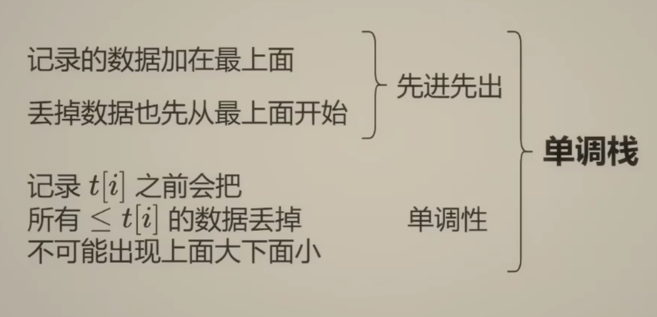

#### 单调栈

特性：

#### 滑动窗口

核心要点：

 1.维护一个有条件的滑动窗口； 

2.右端点右移，导致窗口扩大，是不满足条件的罪魁祸首；

 3.左端点右移目的是为了缩小窗口，重新满足条件

#### **动态规划——背包问题：**

**背包定义：**
那么什么样的问题可以被称作为背包问题？换言之，我们拿到题目如何透过题目的不同包装形式看到里面背包问题的不变内核呢？
我对背包问题定义的理解：
**给定一个背包容量target，再给定一个数组nums(物品)，能否按一定方式选取nums中的元素得到target**
注意：
1、背包容量target和物品nums的类型可能是数，也可能是字符串
2、target可能题目已经给出(显式)，也可能是需要我们从题目的信息中挖掘出来(非显式)(常见的非显式target比如sum/2等)
3、选取方式有常见的一下几种：每个元素选一次/每个元素选多次/选元素进行排列组合
那么对应的背包问题就是下面我们要讲的背包分类

**背包问题分类：**
常见的背包类型主要有以下几种：
1、0/1背包问题：每个元素最多选取一次
2、完全背包问题：每个元素可以重复选择
3、组合背包问题：背包中的物品要考虑顺序
4、分组背包问题：不止一个背包，需要遍历每个背包

而每个背包问题要求的也是不同的，按照所求问题分类，又可以分为以下几种：
1、最值问题：要求最大值/最小值
2、存在问题：是否存在…………，满足…………
3、组合问题：求所有满足……的排列组合

**分类解题模板**
背包问题大体的解题模板是两层循环，分别遍历物品nums和背包容量target，然后写转移方程，
根据背包的分类我们确定物品和容量遍历的先后顺序，根据问题的分类我们确定状态转移方程的写法

首先是背包分类的模板：
**1、0/1背包：外循环nums,内循环target,target倒序且target>=nums[i];**
**2、完全背包：外循环nums,内循环target,target正序且target>=nums[i];**
**3、组合背包(考虑顺序)：外循环target,内循环nums,target正序且target>=nums[i];**
**4、分组背包：这个比较特殊，需要三重循环：外循环背包bags,内部两层循环根据题目的要求转化为1,2,3三种背包类型的模板**

然后是问题分类的模板：
**1、最值问题: dp[i] = max/min(dp[i], dp[i-nums]+1)或dp[i] = max/min(dp[i], dp[i-num]+nums);**
**2、存在问题(bool)：dp[i]=dp[i]||dp[i-num];**
**3、组合问题：dp[i]+=dp[i-num];**

