#### [1. 两数之和](https://leetcode.cn/problems/two-sum/)

思路：两个两的相加直到找出等于target的两个数，通过双层循环，第二层循环遍历第一层循环固定的那个数后面的数，分别与固定的数相加，直到试完所以组合。

```java
class Solution {

  public int[] twoSum(int[] nums, int target) {

​    for (int i = 0; i < nums.length; i++) {

​      for (int j = i + 1; j < nums.length; j++) {

​        if (nums[i] + nums[j] == target) {

​          return new int[] { i, j };

​        }

​      }

​    }

​    return new int[]{};

  }

}
```


#### [283. 移动零](https://leetcode.cn/problems/move-zeroes/)

思路：用flag标记非零元素应该放置的位置，i遍历整个数组，当i指针遇到非零元素时，交换i上的值和flag上的值，且flag标记前进一位。交换到i到达最后且flag标记过所有非零元素

```c++
class Solution {
public:
    void moveZeroes(vector<int>& nums) {
        int flag = 0;
        for(int i = 0;i<nums.size();i++){
            if(nums[i]!=0){
                if(i!=flag){
                int n = nums[i];
                nums[i]=nums[flag];
                nums[flag]=n;
                }
                flag++;
            }
        }
    }
};
```


#### [160. 相交链表](https://leetcode.cn/problems/intersection-of-two-linked-lists/)

思路：双重循环逐一比对两个链表的所有节点，第二次循环，指针pb每次重新指向头节点，直到找到第一个相同的节点（相同的地址）。

```c++
/**
 * Definition for singly-linked list.
 * struct ListNode {
 *     int val;
 *     ListNode *next;
 *     ListNode(int x) : val(x), next(NULL) {}
 * };
 */
class Solution {
public:
    ListNode *getIntersectionNode(ListNode *headA, ListNode *headB) {
        ListNode *pa = headA;
        while(pa != NULL){
            ListNode *pb = headB;
            while(pb != NULL){
                if(pa == pb){
                    return pa;
                }
                pb = pb->next;
            }
            pa = pa->next;
        }
        return NULL;
    }
};
```


#### [206. 反转链表](https://leetcode.cn/problems/reverse-linked-list/)

思路：用头插法反转链表，将原链表节点逐个移到新链表头部，实现顺序颠倒。

```c++
/**
 * Definition for singly-linked list.
 * struct ListNode {
 *     int val;
 *     ListNode *next;
 *     ListNode() : val(0), next(nullptr) {}
 *     ListNode(int x) : val(x), next(nullptr) {}
 *     ListNode(int x, ListNode *next) : val(x), next(next) {}
 * };
 */
class Solution {
public:
    ListNode* reverseList(ListNode* head) {
        ListNode* newHead = new ListNode();
        ListNode* p = head;
        while(p){
            ListNode* temp = p->next;
            p->next=newHead->next;
            newHead->next=p;
            p=temp;
        }
        ListNode* result = new ListNode();
        result= newHead->next;
        return result;
    }
};
```


#### [234. 回文链表](https://leetcode.cn/problems/palindrome-linked-list/)

思路：通过尾插法复制原链表得到相同顺序的副本，再用头插法反转该副本得到逆序链表，最后比较原链表与逆序链表是否一致来判断是否为回文。

```c++
/**
 * Definition for singly-linked list.
 * struct ListNode {
 *     int val;
 *     ListNode *next;
 *     ListNode() : val(0), next(nullptr) {}
 *     ListNode(int x) : val(x), next(nullptr) {}
 *     ListNode(int x, ListNode *next) : val(x), next(next) {}
 * };
 */
class Solution {
public:
    bool isPalindrome(ListNode* head) {
        ListNode* copyHead = new ListNode();
        ListNode* t = copyHead;
        ListNode* curr = head;
        //复制
        while (curr) {
            ListNode* newNode = new ListNode(curr->val);
            t->next = newNode; 
            t = t->next;
            curr = curr->next;
        }
        ListNode* reversedCopyHead = reverseList(copyHead);
        // 比较原链表和反转后的复制链表
        curr = head;
        while (curr&& reversedCopyHead) {
            if (curr->val != reversedCopyHead->val) {
                return false;
            }
            curr = curr->next;
            reversedCopyHead = reversedCopyHead->next;
        }
        return true;
    }
//反转复制的链表
    ListNode* reverseList(ListNode* head) {
        ListNode* newHead = new ListNode();
        ListNode* p = head;
        while (p) {
            ListNode* temp = p->next;
            p->next = newHead->next;
            newHead->next = p;
            p = temp;
        }
        ListNode* result = newHead->next;
        return result;
    }
};
```


#### [141. 环形链表](https://leetcode.cn/problems/linked-list-cycle/)

思路：用哈希集合记录已访问节点，从表头开始遍历：若当前节点在集合中，说明有环；若不在，则加入集合并继续遍历下一个节点。visited.count()用于检查集合中是否存在指定元素

```c++
/**
 * Definition for singly-linked list.
 * struct ListNode {
 *     int val;
 *     ListNode *next;
 *     ListNode(int x) : val(x), next(NULL) {}
 * };
 */
class Solution {
public:
    bool hasCycle(ListNode *head) {
        unordered_set<ListNode*> visited;
        ListNode* p = head;
        while(p){
            if(visited.count(p)){
                return true;
            }
            visited.insert(p);
            p=p->next;
        }
        return false;
    }
};
```


#### [21. 合并两个有序链表](https://leetcode.cn/problems/merge-two-sorted-lists/)

思路：`newlist`作为合并的新链表开头，用指针`p`构建新链表，`p1`、`p2`分别遍历两个输入链表。比较`p1`和`p2`指向的值，将较小节点接入新链表，同时移动对应指针，遍历结束后，因为输入链表是升序排列，所以直接将剩余链表接入新链表尾部

```c++
/**
 * Definition for singly-linked list.
 * struct ListNode {
 *     int val;
 *     ListNode *next;
 *     ListNode() : val(0), next(nullptr) {}
 *     ListNode(int x) : val(x), next(nullptr) {}
 *     ListNode(int x, ListNode *next) : val(x), next(next) {}
 * };
 */
class Solution {
public:
    ListNode* mergeTwoLists(ListNode* list1, ListNode* list2) {
        ListNode* p1 = list1;
        ListNode* p2 = list2;
        ListNode* newlist = new ListNode();
        ListNode* p = newlist;
        while(p1&&p2){
            if(p1->val<=p2->val){
                p->next = p1;
                p1=p1->next;
            }else{
                p->next = p2;
                p2=p2->next;
            }
            p=p->next;
        }
        if(p1){
            p->next = p1;
        }else{
            p->next=p2;
        }
        ListNode* result = newlist->next;
        return result;
    }
};
```


#### [94. 二叉树的中序遍历](https://leetcode.cn/problems/binary-tree-inorder-traversal/)

思路：采用递归方式实现中序遍历，按照左子树 、根节点 、右子树（中序遍历规则）访问节点，通过**引用传递**节点的值，直到为空节点。

```c++
/**
 * Definition for a binary tree node.
 * struct TreeNode {
 *     int val;
 *     TreeNode *left;
 *     TreeNode *right;
 *     TreeNode() : val(0), left(nullptr), right(nullptr) {}
 *     TreeNode(int x) : val(x), left(nullptr), right(nullptr) {}
 *     TreeNode(int x, TreeNode *left, TreeNode *right) : val(x), left(left), right(right) {}
 * };
 */
class Solution {
public:
    vector<int> inorderTraversal(TreeNode* root) {
        vector<int> reslut;
        traversal(root,reslut);
        return reslut;
    }
    void traversal(TreeNode* node,vector<int>& val){
        if(node==nullptr)
        return;
        traversal(node->left,val);
        val.push_back(node->val);
        traversal(node->right,val);
    }
};
```


#### [104. 二叉树的最大深度](https://leetcode.cn/problems/maximum-depth-of-binary-tree/)

思路：使用深度优先搜索计算二叉树最大深度。以空节点深度为 0 作为终止条件，递归计算当前节点左右子树的最大深度，取两者中的最大值加 1（计入当前节点），即为当前节点所在子树的最大深度。从**叶子节点**逐层向上叠加，最终得到整棵树的最大深度。

```c++
/**
 * Definition for a binary tree node.
 * struct TreeNode {
 *     int val;
 *     TreeNode *left;
 *     TreeNode *right;
 *     TreeNode() : val(0), left(nullptr), right(nullptr) {}
 *     TreeNode(int x) : val(x), left(nullptr), right(nullptr) {}
 *     TreeNode(int x, TreeNode *left, TreeNode *right) : val(x), left(left), right(right) {}
 * };
 */
class Solution {
public:
    int maxDepth(TreeNode* root) {
        if(root == nullptr)
        return 0;
        int leftDepth = maxDepth(root->left);
        int rightDepth = maxDepth(root->right);
        return max(leftDepth,rightDepth)+1;
    }
};
```


#### [226. 翻转二叉树](https://leetcode.cn/problems/invert-binary-tree/)

思路：采用**递归**思路，先判断当前节点是否为空，若为空则直接返回；否则递归翻转当前节点的左子树和右子树，然后交换当前节点的左右子树指针，最终返回处理后的当前节点，从而实现整棵二叉树的翻转。

```c++
/**
 * Definition for a binary tree node.
 * struct TreeNode {
 *     int val;
 *     TreeNode *left;
 *     TreeNode *right;
 *     TreeNode() : val(0), left(nullptr), right(nullptr) {}
 *     TreeNode(int x) : val(x), left(nullptr), right(nullptr) {}
 *     TreeNode(int x, TreeNode *left, TreeNode *right) : val(x), left(left), right(right) {}
 * };
 */
class Solution {
public:
    TreeNode* invertTree(TreeNode* root) {
        if(root == nullptr){
            return nullptr;
        }
        TreeNode* left = invertTree(root->left);
        TreeNode* right = invertTree(root->right);
        root->left = right;
        root->right = left;
        return root;
    }
};
```


#### [101. 对称二叉树](https://leetcode.cn/problems/symmetric-tree/)

思路：还是通过递归，先检查根节点是否为空（空树视为对称），否则调用symmetric函数比较左右子树；辅助函数先判断两节点是否都为空（对称）或仅有一个为空（不对称），再比较节点值是否相等，最后递归比较左节点的左子树与右节点的右子树、左节点的右子树与右节点的左子树，只有所有对应位置都满足条件才返回对称。

```c++
/**
 * Definition for a binary tree node.
 * struct TreeNode {
 *     int val;
 *     TreeNode *left;
 *     TreeNode *right;
 *     TreeNode() : val(0), left(nullptr), right(nullptr) {}
 *     TreeNode(int x) : val(x), left(nullptr), right(nullptr) {}
 *     TreeNode(int x, TreeNode *left, TreeNode *right) : val(x), left(left), right(right) {}
 * };
 */
class Solution {
public:
    bool isSymmetric(TreeNode* root) {
        if(root == nullptr)
        return true;
        return symmetric(root->left,root->right);
    }
    bool symmetric(TreeNode* left,TreeNode* right){
        if(!left && !right)
        return true;
        if(!left || !right)
        return false;
        if(left->val != right->val){
            return false;
        }
        return symmetric(left->left,right->right)&&symmetric(left->right,right->left);
    }
};
```


#### [543. 二叉树的直径](https://leetcode.cn/problems/diameter-of-binary-tree/)

思路：遍历所有节点，算出每个节点的 "左段长度 + 右段长度"，其中最大的那个值就是整个树的直径。通过递归的方式，一边计算每个节点往下能伸多远（深度），一边把左右两段加起来和当前最大直径比一比，更新最大的那个值。

```c++
/**
 * Definition for a binary tree node.
 * struct TreeNode {
 *     int val;
 *     TreeNode *left;
 *     TreeNode *right;
 *     TreeNode() : val(0), left(nullptr), right(nullptr) {}
 *     TreeNode(int x) : val(x), left(nullptr), right(nullptr) {}
 *     TreeNode(int x, TreeNode *left, TreeNode *right) : val(x), left(left), right(right) {}
 * };
 */
class Solution {
    int maxDiameter = 0;
    int depth(TreeNode* root) {
        if(root == nullptr) return 0;
        
        int leftDepth = depth(root->left);
        int rightDepth = depth(root->right);
        maxDiameter = max(maxDiameter, leftDepth + rightDepth);
        return max(leftDepth, rightDepth) + 1;
    }
    
public:
    int diameterOfBinaryTree(TreeNode* root) {
        if(root == nullptr) return 0;
        depth(root);
        return maxDiameter;
    }
};
```


#### [108. 将有序数组转换为二叉搜索树](https://leetcode.cn/problems/convert-sorted-array-to-binary-search-tree/)

思路：以**二分法**选取数组中间元素作为当前子树的根节点（保证左右子树平衡），再**递归**地用同样方法将中间元素左侧数组构建为左子树、右侧数组构建为右子树，最终形成满足 “左小右大” 特性且左右高度差不超过 1 的平衡二叉搜索树。

```c++
/**
 * Definition for a binary tree node.
 * struct TreeNode {
 *     int val;
 *     TreeNode *left;
 *     TreeNode *right;
 *     TreeNode() : val(0), left(nullptr), right(nullptr) {}
 *     TreeNode(int x) : val(x), left(nullptr), right(nullptr) {}
 *     TreeNode(int x, TreeNode *left, TreeNode *right) : val(x), left(left), right(right) {}
 * };
 */
class Solution {
public:
    TreeNode* traversal(vector<int>& nums, int left, int right) {
        if (left > right) {
            return nullptr;
        }
        int mid = left + (right - left)/2;
        TreeNode* root = new TreeNode(nums[mid]);
        root->left = traversal(nums, left, mid - 1);
        root->right = traversal(nums, mid + 1, right);
        return root;
    }
    TreeNode* sortedArrayToBST(vector<int>& nums) {
        return traversal(nums, 0, nums.size() - 1);
    }
};
```


#### [35. 搜索插入位置](https://leetcode.cn/problems/search-insert-position/)

思路：通过二分查找：先用左右指针分别指向数组的起始和末尾，然后在左右指针未交叉（left ≤ right）的循环中，不断计算中间位置 mid，将数组中间元素与目标值对比： 若中间元素小于目标值，说明目标值在 mid 右侧，将 left 移至 mid+1；若中间元素大于等于目标值，说明目标值在 mid 左侧或就是 mid，将 right 移至 mid-1。当循环结束时，left 指针恰好停在**第一个大于等于目标值的位置**，这个位置就是目标值插入后能保持数组有序的正确位置，直接返回 left 即可。

```c++
class Solution {
public:
    int searchInsert(vector<int>& nums, int target) {
    int left=0,right=nums.size()-1;
    while(left<=right){
        int mid=(left+right)/2;
        if(nums[mid]<target){
            left=mid+1;
        }else{
            right=mid-1;
        }
    }
    return left;
    }
};
```


#### [20. 有效的括号](https://leetcode.cn/problems/valid-parentheses/)

思路：用栈来匹配括号：遍历字符串时，遇到左括号（'(', '[', '{'）就暂时存到栈里；遇到右括号时，就检查栈顶是否有对应的左括号（比如 ')' 对应 '(', '}' 对应 '{'），如果没有对应左括号或栈为空（没左括号可匹配），就说明无效；如果匹配上了，就把栈顶的左括号移除。最后如果栈空了，说明所有括号都正确配对，返回有效；否则无效。

```c++
class Solution {
public:
    bool isValid(string s) {
      stack<int> p;
      for (int i = 0; i < s.size(); i++) {
        if (s[i] == '(' || s[i] == '[' || s[i] == '{') p.push(i);
        else {
          if (p.empty()) return false;
          if (s[i] == ')' && s[p.top()] != '(') return false;
          if (s[i] == '}' && s[p.top()] != '{') return false;
          if (s[i] == ']' && s[p.top()] != '[') return false;
          p.pop();
        }
      }
      return p.empty();
    }
};
```


#### [121. 买卖股票的最佳时机](https://leetcode.cn/problems/best-time-to-buy-and-sell-stock/)

思路：cost 为初始买入成本、 profit 为0，即无交易利润。遍历股价时，用 min 更新最低成本，用 max 计算当前价与最低价的差值，不断刷遍历新最大利润，最终返回结果。

```c++
class Solution {
public:
    int maxProfit(vector<int>& prices) {
        int cost = prices[0];
        int profit = 0;
        for (int price : prices) {
            cost = min(cost, price);
            profit = max(profit, price - cost);
        }
        return profit;
    }
};
```


#### [70. 爬楼梯](https://leetcode.cn/problems/climbing-stairs/)

思路：因为每次只能跨1阶或2阶，要到第n级台阶，最后一步要么是从第n-1级跨1阶，要么是从第n-2级跨2阶。 比如已知n=3时有3种跳法（1+1+1、1+2、2+1），n=4时有5种跳法（1+1+1+1、1+2+1、2+1+1、1+1+2、2+2）；求n=5的跳法时，只需给n=4的5种跳法末尾都加1阶（对应最后跨1阶的情况），给n=3的3种跳法末尾都加2阶（对应最后跨2阶的情况），总共5+3=8种，即f(5)=f(4)+f(3)=8，完全符合所以f(n)=f(n-1)+f(n-2)。

通过循环n-1次，不断更新 a 和 b （ a 代表前2级的方法数， b 代表前1级的方法数），最终 b 即为爬到第n级的总方法数。

```c++
class Solution {
public:
    int climbStairs(int n) {
        int a = 1, b = 1, sum;
        for(int i = 0; i < n - 1; i++){
            sum = a + b;
            a = b;
            b = sum;
        }
        return b;
    }
};
```


#### [118. 杨辉三角](https://leetcode.cn/problems/pascals-triangle/)

思路：杨辉三角的性质是每个数等于它左上方和右上方的数之和。**vector<vector<int>> result(numRows)**;创建一个名为result的二维向量，初始化为包含 `numRows` 行。每行初始化为长度等于行数 + 1 且元素全为 1（直接确定首尾的 1）`resize(i + 1, 1)` ，再通过循环计算每行中间元素，其值为上一行对应位置左上方与正上方元素之和。

```c++
class Solution {
public:
    vector<vector<int>> generate(int numRows) {
        vector<vector<int>> result(numRows);
        for (int i = 0; i < numRows; i++) {
            result[i].resize(i + 1, 1);
            for (int j = 1; j < i; j++) {
                result[i][j] = result[i - 1][j - 1] + result[i - 1][j];
            }
        }
        return result;
    }
};
```


#### [136. 只出现一次的数字](https://leetcode.cn/problems/single-number/)

思路：题目要求时间复杂度 *O*(*N*) ，空间复杂度 *O*(1) ，因此不能用暴力法。使用哈希表解题，定义`unordered_map<int, int>`类型的哈希表map，键为数组元素，值为该元素出现的次数。第一个循环遍历数组nums，对每个元素执行map[num]++，完成所有元素出现次数的统计（出现两次的元素值会被记为 2，只出现一次的记为 1）。第二个循环再次遍历数组，对每个元素num检查其在哈希表中的次数，若map[num] == 1，则该元素即为目标，直接返回。

```c++
class Solution {
public:
    int singleNumber(vector<int>& nums) {
        unordered_map<int,int> map;
        for(int num:nums)
            map[num]++;
        for(int num:nums)
            if(map[num] == 1) return num;
        return 0;
    }
};
```


#### [49. 字母异位词分组](https://leetcode.cn/problems/group-anagrams/)

思路：对于输入的每个字符串，先对其字符进行排序（互为字母异位词的字符串排序后会完全相同），以排序后的字符串作为键，将原字符串存入该键对应的列表中；遍历所有字符串完成分组后，收集映射中所有列表，即为字母异位词的分组结果。

```c++
class Solution {
public:
    vector<vector<string>> groupAnagrams(vector<string>& strs) {
        
        map<string, vector<string>> m;
        for (int i = 0; i < strs.size(); i++) {
            string data = strs[i];
            sort(data.begin(), data.end());
            m[data].push_back(strs[i]);
        }
        vector<vector<string>> ret;
        for (map<string, vector<string>>::iterator it = m.begin();
             it!= m.end(); it++) {
            ret.push_back(it->second);
        }
        return ret;
    }
};
```


#### [128. 最长连续序列](https://leetcode.cn/problems/longest-consecutive-sequence/)

思路：通过排序使连续元素相邻，再遍历统计最长连续序列长度：首先处理边界情况，若数组为空则返回 0，若只有一个元素则返回 1；之后对数组排序，使连续的元素在数组中相邻排列；接着遍历排序后的数组，通过比较当前元素与下一个元素的关系统计连续序列 —— 若下一个元素是当前元素加 1，说明连续，当前序列长度加 1 并更新最长长度；若下一个元素与当前元素不相等（排除重复元素），则当前序列中断，重置当前长度为 1；若遇到重复元素则不改变当前长度；最后返回记录的最长连续序列长度。

```c++
class Solution {
public:
    int longestConsecutive(vector<int>& nums) {
        int count=1,n=nums.size();
        int maxLen=1;
        if(n==0 || n==1){
            return n;
        }
        sort(nums.begin(),nums.end());
        for(size_t i=0;i<n-1;++i){          
                if(nums[i+1]==nums[i]+1){
                    count++;
                    if(count>maxLen)
                        maxLen=count;
                }else if(nums[i]!=nums[i+1])
                {
                    count=1;
                }
            }
            return maxLen;
    }
};
```


#### [169. 多数元素](https://leetcode.cn/problems/majority-element/)

思路：用哈希表统计数组中各元素的出现次数，先计算数组长度的一半作为判断依据，遍历数组时更新每个元素的计数，一旦某元素的计数超过阈值，即确定为多数元素并返回。

```c++
class Solution {
public:
    int majorityElement(vector<int>& nums) {
          int mid = nums.size()/2;
        unordered_map<int,int> map;
        int n;
        for(int i = 0; i<nums.size(); i++)
        {
            map[nums[i]]++;
            if(map[nums[i]]>mid)
            {
                n  =nums[i];
            }
        }
        return n;
    }
};
```


#### [15. 三数之和](https://leetcode.cn/problems/3sum/)

思路：立意排序+双指针，先把数组从小到大排序，这样方便后续找符合条件的三个数且避免重复。接着固定第一个数（用i遍历），如果它和前一个数一样就跳过（防止重复结果）。然后把目标值设为这个数的相反数，再用两个指针——一个从第一个数后面开始（j，找第二个数），一个从数组末尾开始（k，找第三个数）。找第二个数时，若它和前一个数一样也跳过（避免重复），之后调整k的位置：只要j在k左边且两数相加比目标值大，就把k往左移（让和变小）。如果j和k碰面了，说明当前i下没符合条件的，就换下一个i；要是两数相加刚好等于目标值，就把这三个数（i、j、k对应的数）存起来，最后遍历完所有情况，得到的就是所有不重复的、和为0的三元组。

```c++
class Solution {
public:
    vector<vector<int>> threeSum(vector<int>& nums) {
         vector<vector<int>> ans;
        sort(nums.begin(),nums.end());
        int n = nums.size();
        int k  = 0,target = 0;
        for(int i = 0;i < n ;i++)
        {
            if( i > 0 && nums[i] == nums[i-1])
            {
                 continue;
            }
            k = n - 1;//指向第三个数的下标
            target = -nums[i];
            for(int j= i+1;j < n;j++)
            {
                if( j > i + 1 && nums[j] == nums[j-1] )
                {
                    continue;
                }
                while( j < k && nums[j] + nums[k] > target)
                {
                    k--;
                }
                if(j == k)
                {
                    break;
                }
               if(nums[j] + nums[k] == target)
               {
                   ans.push_back({nums[i],nums[j],nums[k]});
               }
            }
        }
        return ans;
    }
};
```


#### [11. 盛最多水的容器](https://leetcode.cn/problems/container-with-most-water/)

思路：双指针：用左右指针分别位于数组两端，通过计算当前指针形成的容器水量（由两指针处高度的最小值与间距决定）并不断在比较后更新最大值，随后始终移动较矮边界的指针（因移动较高边界无法增大水量），最终找到最大水量。

```c++
class Solution {
public:
    int maxArea(vector<int>& height) {
        int left = 0;                   
        int right = height.size() - 1;  
        int max_water = 0;     
        while (left < right) {
            int current_water = min(height[left], height[right]) * (right - left);

            if (current_water > max_water) {
                max_water = current_water;
            }

            if (height[left] < height[right]) {
                left++;
            } else {
                right--;
            }
        }
        return max_water;
    }
};
```


#### [3. 无重复字符的最长子串](https://leetcode.cn/problems/longest-substring-without-repeating-characters/)

思路：通过两层for循环可以实现暴力破解寻找无重复字符串，最外层循环，作为每次生成子字符串的头节点；第二层循环，每次从i位置开始，拼装子字符串，用哈希表记录当前子串中的字符以检查是否重复，一旦遇到重复就停止，同时记录当前子串的长度并更新全局最长长度，最终返回找到的最大长度。

```c++
class Solution {
public:
    int lengthOfLongestSubstring(string s) {
        int result = 0;
        int temp = 0;
        for (int i = 0; i < s.length(); i++){
            unordered_map<char, int> map;
            temp = 0;
            for (int j = i; j < s.length(); j++) {
                if (map.find(s[j]) != map.end()) {
                    break;
                } else {
                    map[s[j]] = j;
                    temp++;
                    result = max(result, temp);
                }
            }
        }
        return result;
    }
};
```


#### [438. 找到字符串中所有字母异位词](https://leetcode.cn/problems/find-all-anagrams-in-a-string/)

思路：

**findAnagrams 函数**

初始mp1记录p中每个字符的出现次数（固定不变）。mp2：记录s中当前滑动窗口内字符的出现次数（随窗口移动动态更新）。维护一个长度为p.size()的窗口，每次滑动调用`check`函数判断当前窗口是否为p的异位词，若是则记录`left`（起始索引）。然后移动窗口：左边界右移`left++`，需减少mp2中对应字符的频率（若频率变为 0 则从mp2中删除，避免干扰后续判断）；右边界右移`right++`，需增加`mp2`中对应新字符的频率。遍历结束后，所有记录的left即为s中所有p的异位词的起始索引，最终返回这些索引组成的数组ret。

**check 函数**

异位词的本质是 “字符种类和每种字符的出现次数完全相同”，因此用两个map（mp1和mp2）分别存储p和s中当前窗口的字符频率。check函数两点验证是否为异位词：

- 若两个map的大小不同（字符种类不同），直接返回false；

- 遍历mp1中的每个字符，检查mp2中是否存在该字符且频率相同，若有任何不匹配则返回false，否则返回true。

  

```c++
class Solution {
public:
    bool check(map<int,int>& mp1,map<int,int>& mp2)
    {
        if (mp1.size() != mp2.size()) 
            return false;
 
        for (const auto pair : mp1) 
        {
            auto it = mp2.find(pair.first);
            if (it == mp2.end() || it->second != pair.second) 
                return false;
        }
        return true;
    }
 
    vector<int> findAnagrams(string s, string p)
    {
        vector<int> ret;
        map<int,int> mp1,mp2;
        for (int i=0;i<p.size();i++)
        {
            mp1[p[i]]++;
            mp2[s[i]]++;
        }
            
        for (int left=0,right=p.size()-1; right<s.size();left++,right++)
        {
            if (check(mp1,mp2))
            {
                ret.push_back(left);
            }
            mp2[s[left]]--;
            mp2[s[right+1]]++;
            if (mp2[s[left]]==0)
                mp2.erase(s[left]);
        }
        return ret;
    }
};
```


#### [560. 和为 K 的子数组](https://leetcode.cn/problems/subarray-sum-equals-k/)

思路：利用暴力枚举法，外层循环固定子数组的起始索引left，内层循环从 left 开始遍历结束索引 right，在遍历过程中实时累加从nums [left] 到 nums [right]的元素和 sum，每当sum等于k时，就将count加1，最终返回count（所有符合条件的连续子数组的总数）

```c++
class Solution {
public:
    int subarraySum(vector<int>& nums, int k) {
        int count = 0;
        int len = nums.size();
        for (int left = 0; left < len; left++) {
            int sum = 0;
            for (int right = left; right < len; right++) {
                sum += nums[right];
                if (sum == k) {
                    count++;
                }
            }
        }
        return count;
    }
};
```


#### [53. 最大子数组和](https://leetcode.cn/problems/maximum-subarray/)

思路：通过一次线性遍历，动态维护 “以当前元素结尾的子数组最大和” 与 “全局最大子数组和”。初始化时，两者均设为数组首个元素；遍历后续元素时，若前者为非正数（说明之前的子数组无增益），则从当前元素重新开始计算局部和，否则将当前元素加入局部和；每次更新局部和后，都与全局最大值比较并更新，确保全局最大值始终记录已遍历部分的最优解。

```c++
class Solution {
public:
    int maxSubArray(vector<int>& nums) {
        int res = nums[0];
        int maxnum = nums[0];
        for (int i = 1; i < nums.size(); i++) {
            if (maxnum <= 0) {
                maxnum = nums[i];
            } else if (maxnum > 0) {
                maxnum += nums[i];
            }
            res = max(maxnum, res);
        }
        return res;
    }
};
```


#### [189. 轮转数组](https://leetcode.cn/problems/rotate-array/)

思路：通过三次反转操作来实现数组的旋转。给定一个整数数组 nums 和一个整数 k，将数组向右旋转 k 个位置。旋转后，数组的最后 k 个元素会移动到数组的开头，其余元素依次向后移动。首先反转整个数组，使得数组的顺序完全颠倒。再反转前 k 个元素，使得它们恢复到正确的顺序。最后反转剩下的 n - k 个元素，使得它们恢复到正确的顺序

```c++
class Solution {
public:
    void rotate(vector<int>& nums, int k) {        
        int n = nums.size();
        k %= n;
        reverse(nums,0, n - 1);
        reverse(nums,0, k - 1);
        reverse(nums,k, n - 1);
    }
private:
    void reverse(vector<int>& nums, int i, int j) {
        for (; i < j; i++, j--) {
            swap(nums[i], nums[j]);
        }
    }
};
```


#### [56. 合并区间](https://leetcode.cn/problems/merge-intervals/)

思路：对所有区间按照「起始值」进行升序排序。排序后，区间的起始值呈现递增趋势，极大简化了重叠判断逻辑。初始化一个结果集合存储合并后的区间，然后逐个遍历排序后的区间，当前区间 [L,R] 与结果集最后区间比较，结果集空或 L > 最后区间结束值（无重叠），直接加入，否则（有重叠），合并（结束值取两者最大）。遍历完成后，结果集合中即为所有合并后的不重叠区间。

```c++
class Solution {
public:
    vector<vector<int>> merge(vector<vector<int>>& intervals) {
         sort(intervals.begin(), intervals.end());
        vector<vector<int>> merged;
        for (int i = 0; i < intervals.size(); ++i) {
            int L = intervals[i][0], R = intervals[i][1];
            if (!merged.size() || merged.back()[1] < L) {
                merged.push_back({L, R});
            }
            else {
                merged.back()[1] = max(merged.back()[1], R);
            }
        }
        return merged;
    }
};
```


#### [238. 除自身以外数组的乘积](https://leetcode.cn/problems/product-of-array-except-self/)

思路：构建两个辅助数组left和right求解：left[i]存储索引i左侧所有元素的乘积，right[i]存储索引i右侧所有元素的乘积；先从左到右遍历计算left数组，再从右到左遍历计算right数组，最后每个位置i的结果answer[i]即为其左侧所有元素乘积（left[i-1]）与右侧所有元素乘积（right[i+1]）的乘积。

```c++
class Solution {
public:
    vector<int> productExceptSelf(vector<int>& nums) {
          int n = nums.size();
        vector<int> answer(n);
        vector<int> left(n);
        vector<int> right(n);
        left[0] = nums[0];
        right[n-1] = nums[n-1];
        for (int i = 1; i < n; i++) {
            left[i] = left[i-1] * nums[i];
        }
        answer[n-1] = left[n-2];
        for (int i = n-2; i >= 0; i--) {
            right[i] = right[i+1] * nums[i];
            if (i == 0) {
                answer[i] = right[i+1];
                continue;
            }
            answer[i] = left[i-1] * right[i+1];
        }
        return answer;
    }
};
```


#### [73. 矩阵置零](https://leetcode.cn/problems/set-matrix-zeroes/)

思路： 使用两个标记数组去记录初始时0元素的位置，首先创建两个标记数组 `row_mark`（长度为矩阵行数 `m`）和 `column_mark`（长度为矩阵列数 `n`），用于分别记录原始矩阵中存在 0 的行和列；通过第一次遍历矩阵，若遇到元素 `matrix[i][j] == 0`，就将 `row_mark[i]` 和 `column_mark[j]` 设为 1，以此精准标记出所有需要置零的行与列；随后进行第二次遍历，对矩阵中的每个元素 `matrix[i][j]`，只要其所在行被标记（`row_mark[i] == 1`）或所在列被标记（`column_mark[j] == 1`），就将该元素设为 0，最终完成矩阵置零。

```c++
class Solution {
public:
    void setZeroes(vector<vector<int>>& matrix) {
         int m = matrix.size();
        int n = matrix[0].size();
        vector<int> row_mark(m);
        vector<int> column_mark(n);
        for (int i = 0; i < m; i++)
        {
            for (int j = 0; j < n; j++)
            {
                if (matrix[i][j] == 0)
                {
                    row_mark[i] = 1;
                    column_mark[j] = 1;
                }
            }
        }
         for (int i = 0; i < m; i++)
        {
            for (int j = 0; j < n; j++)
            {
                if (row_mark[i] == 1 || column_mark[j] == 1)
                {
                    matrix[i][j] = 0;
                }
            }
        }
    }
};
```


#### [54. 螺旋矩阵](https://leetcode.cn/problems/spiral-matrix/)

思路：
初始化：用 `left` 表示左边界（初始为第 0 列），`right` 表示右边界（初始为最后一列），`top` 表示上边界（初始为第 0 行），`bottom` 表示下边界（初始为最后一行）。
循环打印： “从左向右、从上向下、从右向左、从下向上” 四个方向循环打印。
根据边界打印，即将元素按顺序添加至列表 `result`尾部。
边界向内收缩 1 （代表已被打印）。
每步遍历后通过判断边界是否交叉（如 `top > bottom`、`right < left` 等），决定是否终止循环，若打印完毕则跳出。
返回值： 返回 result 即可。

```c++
class Solution {
public:
    vector<int> spiralOrder(vector<vector<int>>& matrix) {
        int left = 0;
        int right = matrix[0].size() - 1;
        int top = 0;
        int bottom = matrix.size() - 1; 
        vector<int> result;  
        while (true) {
            for (int col = left; col <= right; ++col) {
                result.push_back(matrix[top][col]);
            }
            if (++top > bottom) {
                break;
            }
            for (int row = top; row <= bottom; ++row) {
                result.push_back(matrix[row][right]);
            }
            if (--right < left) {
                break;
            }
            for (int col = right; col >= left; --col) {
                result.push_back(matrix[bottom][col]);
            }
            if (--bottom < top) {
                break;
            }
            for (int row = bottom; row >= top; --row) {
                result.push_back(matrix[row][left]);
            }
            if (++left > right) {
                break;
            }
        }
       return result;
    }
};
```


#### [48. 旋转图像](https://leetcode.cn/problems/rotate-image/)

思路：

1. **转置矩阵**：交换矩阵的行和列（`mat[i][j] <-> mat[j][i]`）。
2. **翻转每一行**：对矩阵的每一行元素进行逆序反转（从左到右的元素变为从右到左)，利用`reverse` 函数（或手动交换）。

```c++
class Solution {
public:
    void rotate(vector<vector<int>>& matrix) {
        int n = matrix.size();
         for (int i = 0; i < n; i++) {
            for (int j = i; j < n; j++) {
                swap(matrix[i][j], matrix[j][i]);
            }
        }
        for (int i = 0; i < n; i++) {
            reverse(matrix[i].begin(), matrix[i].end());
        }
    }
};
```


#### [240. 搜索二维矩阵 II](https://leetcode.cn/problems/search-a-2d-matrix-ii/)

思路：先获取矩阵的行数和列数，然后逐行遍历矩阵；对每一行，利用二分查找法（定义左右边界，通过计算中间位置并与目标值比较，动态调整边界范围）检查该行是否包含目标值，若找到则立即返回 true；若遍历完所有行仍未找到目标值，则返回 false。

```c++
class Solution {
public:
    bool searchMatrix(vector<vector<int>>& matrix, int target) {
        int m = matrix.size(), n = matrix[0].size();
        for(int i=0; i<m; ++i){
            int left = 0, right = n-1;
            while(left <= right){
                int mid = left + (right - left) / 2;
                if(matrix[i][mid] == target) return true;   
                else if(matrix[i][mid] < target) left = mid + 1;
                else right = mid - 1;
            }
        }
        return false;
    }
};
```


#### [142. 环形链表 II](https://leetcode.cn/problems/linked-list-cycle-ii/)

思路：双指针法，两次相遇定位环入口：

1. **第一次相遇：检测是否有环**
   - 初始化快慢指针 `fast` 和 `slow` 都指向头节点，`fast` 每次走 2 步，`slow` 每次走 1 步。
   - 若 `fast` 走到链表末尾（`fast` 或 `fast->next` 为 `nullptr`），说明无环，返回 `nullptr`。
   - 若 `fast` 与 `slow` 相遇，说明有环，进入下一步。
2. **第二次相遇：定位环的入口**
   - 将 `fast` 重新指向头节点，`slow` 留在相遇点。
   - 两指针同时每次走 1 步，当它们再次相遇时，该节点就是环的入口，返回此节点。

原理：第一次相遇时，`slow` 已走了 `n` 个环长，`fast` 走了 `2n` 个环长；第二次同速移动时，`fast` 从头走 `a` 步到入口，`slow` 从相遇点走 `a` 步也到入口（因 `a + n*环长` 是入口位置），故再次相遇点即入口。

```c++
/**
 * Definition for singly-linked list.
 * struct ListNode {
 *     int val;
 *     ListNode *next;
 *     ListNode(int x) : val(x), next(NULL) {}
 * };
 */
class Solution {
public:
    ListNode *detectCycle(ListNode *head) {
        ListNode* fast = head;
        ListNode* slow = head;
        while (true) {
            if (fast == nullptr || fast->next == nullptr) return nullptr;
            fast = fast->next->next;
            slow = slow->next;
            if (fast == slow) break;
        }
        fast = head;
        while (slow != fast) {
            slow = slow->next;
            fast = fast->next;
        }
        return fast;
    }
};
```


#### [2. 两数相加](https://leetcode.cn/problems/add-two-numbers/)

思路：利用逆序链表（个位在前）的特点，模拟手动加法过程：  

1. 用哑节点简化结果链表的头节点处理，用变量记录进位；   
2. 同步遍历两个链表，逐位取对应节点值（空节点取0），计算“两值+进位”的总和；   
3. 总和的个位数作为当前位结果，更新进位（sum/10），并构建新节点；   
4. 遍历至两链表结束且无进位，返回哑节点的下一个节点（结果链表头）。

```c++
/**
 * Definition for singly-linked list.
 * struct ListNode {
 *     int val;
 *     ListNode *next;
 *     ListNode() : val(0), next(nullptr) {}
 *     ListNode(int x) : val(x), next(nullptr) {}
 *     ListNode(int x, ListNode *next) : val(x), next(next) {}
 * };
 */
class Solution {
public:
    ListNode* addTwoNumbers(ListNode* l1, ListNode* l2) {
        ListNode* dummy = new ListNode(0); // 哑节点
        ListNode* current = dummy;
        int carry = 0;
        while (l1 != nullptr || l2 != nullptr || carry != 0) {
            int x = (l1 != nullptr) ? l1->val : 0;
            int y = (l2 != nullptr) ? l2->val : 0;
            
            int sum = x + y + carry;
            carry = sum / 10; // 更新进位
            current->next = new ListNode(sum % 10); // sum的个位数
            current = current->next; 

            if (l1 != nullptr) l1 = l1->next;
            if (l2 != nullptr) l2 = l2->next;
        }
        
        return dummy->next;
    }
};
```


#### [19. 删除链表的倒数第 N 个结点](https://leetcode.cn/problems/remove-nth-node-from-end-of-list/)

思路：通过计算链表长度确定待删除节点的位置，再执行删除操作。先创建值为 0 且 next 指向原链表头节点的虚拟头节点 dummy，接着遍历原链表统计总长度 length，然后让 cur 指针从 dummy 出发，向后移动 length-n 次以定位到待删除节点的前驱节点，随后通过 cur->next = cur->next->next 跳过待删除节点完成删除操作，最后保存 dummy->next 作为新链表头节点并释放 dummy 节点，最终返回新头节点。

```c++
/**
 * Definition for singly-linked list.
 * struct ListNode {
 *     int val;
 *     ListNode *next;
 *     ListNode() : val(0), next(nullptr) {}
 *     ListNode(int x) : val(x), next(nullptr) {}
 *     ListNode(int x, ListNode *next) : val(x), next(next) {}
 * };
 */
class Solution {
public:
    ListNode* removeNthFromEnd(ListNode* head, int n) {
        ListNode* dummy = new ListNode(0,head);
        int length = 0;
        while(head){
            ++length;
            head = head->next;
        }
        ListNode* cur = dummy;
        for(int i=0;i < length-n;i++){
            cur = cur->next;
        }
        cur->next = cur->next->next;
        ListNode* ans = dummy->next;
        delete dummy;
        return ans;
    }
};
```


#### [24. 两两交换链表中的节点](https://leetcode.cn/problems/swap-nodes-in-pairs/)

思路：用递归思路实现链表节点的两两交换，核心是将问题拆解为重复的子问题：首先判断终止条件 —— 若链表为空或仅有一个节点，无需交换，直接返回；否则，将当前头两个节点视为一对，原第二个节点成为新头节点（newHead），通过递归处理这对节点之后的剩余链表，再将原第一个节点的 next 指向递归处理后的子链表，新头节点的 next 指向原第一个节点，完成当前对的交换，最终返回新头节点。如此逐层递归，从局部到整体完成整个链表的两两交换。

```c++
/**
 * Definition for singly-linked list.
 * struct ListNode {
 *     int val;
 *     ListNode *next;
 *     ListNode() : val(0), next(nullptr) {}
 *     ListNode(int x) : val(x), next(nullptr) {}
 *     ListNode(int x, ListNode *next) : val(x), next(next) {}
 * };
 */
class Solution {
public:
    ListNode* swapPairs(ListNode* head) {
        if (head == nullptr || head->next == nullptr) {
            return head;
        }
        ListNode* newHead = head->next;
        head->next = swapPairs(newHead->next);
        newHead->next = head;
        return newHead;
    }
};
```


[138. 随机链表的复制](https://leetcode.cn/problems/copy-list-with-random-pointer/)

思路：通过哈希表实现带随机指针链表的复制，步骤清晰：首先遍历原链表，为每个节点创建值相同的新节点，并将原节点与新节点的对应关系存入哈希表；接着再次遍历原链表，借助哈希表快速找到每个新节点对应的 next 和 random 指针所指的新节点，完成新链表指针关系的构建；最后返回原链表头节点在哈希表中对应的新节点，即为复制链表的头节点。

```c++
/*
// Definition for a Node.
class Node {
public:
    int val;
    Node* next;
    Node* random;
    
    Node(int _val) {
        val = _val;
        next = NULL;
        random = NULL;
    }
};
*/

class Solution {
public:
    Node* copyRandomList(Node* head) {
        Node* cur = head;
        unordered_map<Node*,Node*> map;
        while(cur != nullptr){
            map[cur] = new Node(cur->val);
            cur = cur->next;
        }
        cur = head;
        while(cur != nullptr){
            map[cur]->next = map[cur->next];
            map[cur]->random = map[cur->random];
            cur = cur->next;
        }
        return map[head];
    }
};
```


#### [148. 排序链表](https://leetcode.cn/problems/sort-list/)

思路：：首先通过快慢慢指针找到链表中点，将链表分割为左右两个子链表；然后递归地对两个子链表进行排序，直到子链表长度为 1；最后通过合并函数将两个已排序的子链表按值从小到大合并，最终得到完整的排序链表。

```c++
/**
 * Definition for singly-linked list.
 * struct ListNode {
 *     int val;
 *     ListNode *next;
 *     ListNode() : val(0), next(nullptr) {}
 *     ListNode(int x) : val(x), next(nullptr) {}
 *     ListNode(int x, ListNode *next) : val(x), next(next) {}
 * };
 */
class Solution {
public:
    ListNode* sortList(ListNode* head) {
        return mergeSort(head);
    }

    ListNode* mergeSort(ListNode* head) {
        if (!head || !head->next) return head;
        ListNode* mid = findMid(head);
        ListNode* l1 = head;
        ListNode* l2 = mid->next;
        mid->next = nullptr;
        l1 = mergeSort(l1);
        l2 = mergeSort(l2);
        return merge(l1, l2);
    }

    ListNode* findMid(ListNode* head) {
        ListNode *slow = head, *fast = head;
        while (fast->next && fast->next->next) {
            slow = slow->next;
            fast = fast->next->next;
        }
        return slow;
    }

    ListNode* merge(ListNode* l1, ListNode* l2) {
        ListNode* dummyHead = new ListNode();
        ListNode* cur = dummyHead;
        while (l1 && l2) {
            if (l1->val <= l2->val) {
                cur->next = l1;
                l1 = l1->next;
            }
            else {
                cur->next = l2;
                l2 = l2->next;
            }
            cur = cur->next;
        }
        cur->next = l1 ? l1 : l2;
        return dummyHead->next;
    }
};
```


#### [146. LRU 缓存](https://leetcode.cn/problems/lru-cache/)

思路：根据 LRU 描述，我们至少需要一个数据结构来存节点的新旧程度，新的放一边，老的放另一边，双向链表恰好合适。但链表更新快，却无法快速通过 key 查节点，因此结合字典（哈希表）：字典存 `key=>节点` 的映射，实现定位；双向链表维护使用顺序，最新访问 / 插入的节点放在头部（靠近 `head` 哨兵），最久未使用的节点落到尾部（`head` 的前驱）。

一共有 3 种操作：

-   访问或更新已有节点（get/put 已存在的 key）：先通过哈希表找到节点，将其从当前位置移除后移到链表头部（标记为最新使用）。

- 插入新节点（put 新 key）：创建新节点，通过哈希表记录映射关系，同时将节点直接插入链表头部。

- 淘汰最久未使用节点：当缓存容量超限（哈希表大小超过 maxCapacity），需删除链表尾部节点（head->prev），并同步从哈希表中移除该节点的 key。

  通用函数：addToHead：将指定节点插入链表头部。removeNode：从链表中移除指定节点。getAndMoveToHead 函数封装 “查字典定位节点 + 移到头部更新顺序” 的逻辑，是 `get` 和 `put` 接口的核心依赖，查到节点返回节点，未查到返回空。

```c++
struct CacheNode {
    int key;
    int value;
    CacheNode* prev;
    CacheNode* next;

    CacheNode(int k = 0, int v = 0) : key(k), value(v), prev(nullptr), next(nullptr) {}
};
class LRUCache {
private:
    int maxCapacity;  // 最大容量
    CacheNode* head;  // 哨兵头节点
    unordered_map<int, CacheNode*> keyNodeMap;  // key到节点的映射

    // 移除指定节点
    void removeNode(CacheNode* node) {
        node->prev->next = node->next;
        node->next->prev = node->prev;
    }

    // 将节点插入到链表头部
    void addToHead(CacheNode* node) {
        node->prev = head;
        node->next = head->next;
        node->prev->next = node;
        node->next->prev = node;
    }

     // 更新使用时间
    CacheNode* getAndMoveToHead(int key) {
        auto it = keyNodeMap.find(key);
        if (it == keyNodeMap.end()) {  // 缓存未命中
            return nullptr;
        }
        CacheNode* node = it->second;  // 缓存命中
        removeNode(node); 
        addToHead(node); 
        return node;
    }

public:
    LRUCache(int capacity ): maxCapacity(capacity), head(new CacheNode()) {
        head->prev = head;
        head->next = head;
    }
    
    int get(int key) {
        CacheNode* node = getAndMoveToHead(key);
        return node ? node->value : -1;
    }
    
    void put(int key, int value) {
         CacheNode* node = getAndMoveToHead(key); 
        if (node) {  
            // 缓存已存在，更新值
            node->value = value;
            return;
        }
        // 缓存未存在，创建新节点
        CacheNode* newNode = new CacheNode(key, value);
        keyNodeMap[key] = newNode;
        addToHead(newNode);  // 新增节点放到头部
        
        // 超过最大容量，移除最久未使用的节点（链表尾部）
        if (keyNodeMap.size() > maxCapacity) {
            CacheNode* leastUsedNode = head->prev;  // 尾部节点是最久未使用的
            keyNodeMap.erase(leastUsedNode->key);
            removeNode(leastUsedNode);
        }
    }
};

/**
 * Your LRUCache object will be instantiated and called as such:
 * LRUCache* obj = new LRUCache(capacity);
 * int param_1 = obj->get(key);
 * obj->put(key,value);
 */
```


#### [102. 二叉树的层序遍历](https://leetcode.cn/problems/binary-tree-level-order-traversal/)

思路：采用队列实现二叉树的层序遍历，先将根节点入队，随后循环处理队列中各层节点：每次记录当前队列大小（即当前层节点数），依次取出该数量的节点，收集其值并将非空左右孩子入队，最终将每层节点值组成的列表存入结果，以此按层次顺序完成遍历。

```c++
/**
 * Definition for a binary tree node.
 * struct TreeNode {
 *     int val;
 *     TreeNode *left;
 *     TreeNode *right;
 *     TreeNode() : val(0), left(nullptr), right(nullptr) {}
 *     TreeNode(int x) : val(x), left(nullptr), right(nullptr) {}
 *     TreeNode(int x, TreeNode *left, TreeNode *right) : val(x), left(left), right(right) {}
 * };
 */
class Solution {
public: 
    vector<vector<int>> levelOrder(TreeNode* root) {
        vector<vector<int>> res;
        queue<TreeNode*> queue;
        if (root != nullptr) queue.push(root);
        while (!queue.empty()) {
            int n = queue.size();
            vector<int> level;
            for (int i = 0; i < n; ++i) {
                TreeNode* node = queue.front();
                queue.pop();
                level.push_back(node->val);
                if (node->left != nullptr) queue.push(node->left);
                if (node->right != nullptr) queue.push(node->right);
            }
            res.push_back(level);
        }
        return res;
    }
};
```


#### [98. 验证二叉搜索树](https://leetcode.cn/problems/validate-binary-search-tree/)

思路：通过二叉搜索树“中序遍历结果为严格递增序列” 的特性解题：先对二叉树进行中序遍历（左→根→右），将所有节点值存入`vector`容器（`result`）；再遍历储节点值，若存在任意后一元素≤前一元素，则树无效，反之则有效。

```c++
/**
 * Definition for a binary tree node.
 * struct TreeNode {
 *     int val;
 *     TreeNode *left;
 *     TreeNode *right;
 *     TreeNode() : val(0), left(nullptr), right(nullptr) {}
 *     TreeNode(int x) : val(x), left(nullptr), right(nullptr) {}
 *     TreeNode(int x, TreeNode *left, TreeNode *right) : val(x), left(left), right(right) {}
 * };
 */
class Solution {
public:
    bool isValidBST(TreeNode* root) {   
        if (root == nullptr) {
            return true;
        }
        vector<int> result;
        traversal(root,result);
        for (int i = 0; i < result.size() - 1; ++i) {
            if (result[i + 1] <= result[i]) {
                return false;
            }
        }
        return true;
    }
    void traversal(TreeNode* node,vector<int>& val){
        if(node==nullptr)
        return;
        traversal(node->left,val);
        val.push_back(node->val);
        traversal(node->right,val);
    }
};
```


#### [230. 二叉搜索树中第 K 小的元素](https://leetcode.cn/problems/kth-smallest-element-in-a-bst/)

思路：在上一题得二叉搜索树具有一个重要性质：二叉搜索树的中序遍历为递增序列。也就是说，本题可被转化为求中序遍历的第 k 个节点。递归遍历时计数，统计当前节点的序号。递归到第 k 个节点时，记录结果 res 后提前返回。即可找到的第 k 小元素。

```c++
/**
 * Definition for a binary tree node.
 * struct TreeNode {
 *     int val;
 *     TreeNode *left;
 *     TreeNode *right;
 *     TreeNode() : val(0), left(nullptr), right(nullptr) {}
 *     TreeNode(int x) : val(x), left(nullptr), right(nullptr) {}
 *     TreeNode(int x, TreeNode *left, TreeNode *right) : val(x), left(left), right(right) {}
 * };
 */
class Solution {
private:
    int res;  // 第k小的结果
    int count; // 计数第k个元素

public:
    int kthSmallest(TreeNode* root, int k) {
        count = k;
        traversal(root);
        return res; 
    }
    void traversal(TreeNode* node){
        if(node==nullptr)
        return;
        traversal(node->left);
        if (--count == 0) {
            res = node->val;
            return; 
        }
        traversal(node->right);
    }
};
```


#### [199. 二叉树的右视图](https://leetcode.cn/problems/binary-tree-right-side-view/)

思路：实现二叉树的右视图，只需在层序遍历的基础上，将每一层的最后一个元素加入结果数组。通过队列存储各层节点，每次处理一层时，先记录当前层的节点总数，然后依次遍历该层的每个节点，将其左右子节点加入队列以准备下一层的遍历。在遍历当前层的过程中，当遇到该层的最后一个节点（即索引等于当前层节点总数减 1 的节点）时，其值就是该层从右侧能看到的节点值，将其加入结果数组。最终，遍历完所有层后，结果数组便包含了从右侧观察二叉树时依次看到的各层节点值，即二叉树的右视图。

```c++
/**
 * Definition for a binary tree node.
 * struct TreeNode {
 *     int val;
 *     TreeNode *left;
 *     TreeNode *right;
 *     TreeNode() : val(0), left(nullptr), right(nullptr) {}
 *     TreeNode(int x) : val(x), left(nullptr), right(nullptr) {}
 *     TreeNode(int x, TreeNode *left, TreeNode *right) : val(x), left(left), right(right) {}
 * };
 */
class Solution {
public:
    vector<int> rightSideView(TreeNode* root) {
        vector<int> res;
        queue<TreeNode*> queue;
        if (root != nullptr) queue.push(root);
        while (!queue.empty()) {
            int n = queue.size();
            for (int i = 0; i < n; ++i) {
                TreeNode* node = queue.front();
                queue.pop();
                if(i == n-1){
                res.push_back(node->val);
                }
                if (node->left != nullptr) queue.push(node->left);
                if (node->right != nullptr) queue.push(node->right);
            }
        }
        return res;
    }
};
```


#### [114. 二叉树展开为链表](https://leetcode.cn/problems/flatten-binary-tree-to-linked-list/)

思路：

1. 按照先序遍历的顺序依次访问节点。
2. 每次访问一个节点时，将它连接到前一个节点的`right`指针上。（用一个全局变量`prev`记录**上一个被访问的节点**；用`TreeNode* right`保存**当前节点的right指针**）
3. 同时清空当前节点的`left`指针（因为单链表不需要左子树）。

```c++
/**
 * Definition for a binary tree node.
 * struct TreeNode {
 *     int val;
 *     TreeNode *left;
 *     TreeNode *right;
 *     TreeNode() : val(0), left(nullptr), right(nullptr) {}
 *     TreeNode(int x) : val(x), left(nullptr), right(nullptr) {}
 *     TreeNode(int x, TreeNode *left, TreeNode *right) : val(x), left(left), right(right) {}
 * };
 */
class Solution {
private:
    TreeNode* prev = nullptr;
public:
    void flatten(TreeNode* root) {
        if(root==nullptr){
            return;
        }
        TreeNode* right = root->right;
        if (prev != nullptr) {
            prev->right = root;
            prev->left = nullptr; 
        }
        prev=root;
        flatten(root->left);
        flatten(right);
    }
};
```


#### [105. 从前序与中序遍历序列构造二叉树](https://leetcode.cn/problems/construct-binary-tree-from-preorder-and-inorder-traversal/)

思路：利用前序遍历（根 - 左 - 右）和中序遍历（左 - 根 - 右）的特性。每一次都先通过**前序遍历（preorder）**确定当前根节点（第一个元素必然是当前树的**根节点**），再划分左右子树的遍历序列，在**中序遍历（inorder）**中根据preorder中找到的根节划分左右子树（inorder根节点左侧的所有元素是**左子树的中序序列**，右侧是**右子树的中序序列**），还可计算左子树的节点个数，以此划分左右子树，递归构建左右子树，每次生成当前根节点并返回。

```c++
/**
 * Definition for a binary tree node.
 * struct TreeNode {
 *     int val;
 *     TreeNode *left;
 *     TreeNode *right;
 *     TreeNode() : val(0), left(nullptr), right(nullptr) {}
 *     TreeNode(int x) : val(x), left(nullptr), right(nullptr) {}
 *     TreeNode(int x, TreeNode *left, TreeNode *right) : val(x), left(left), right(right) {}
 * };
 */
class Solution {
public:
    TreeNode* buildTree(vector<int>& preorder, vector<int>& inorder) {
         if (preorder.empty()) { // 空节点
            return nullptr;
        }
        int left_size = ranges::find(inorder, preorder[0]) - inorder.begin(); // 左子树的大小
        vector<int> preordernums1(preorder.begin() + 1, preorder.begin() + 1 + left_size);
        vector<int> preordernums2(preorder.begin() + 1 + left_size, preorder.end());
        vector<int> inordernums1(inorder.begin(), inorder.begin() + left_size);
        vector<int> inordernums2(inorder.begin() + 1 + left_size, inorder.end());
        TreeNode* left = buildTree(preordernums1, inordernums1);
        TreeNode* right = buildTree(preordernums2, inordernums2);
        return new TreeNode(preorder[0], left, right);
    }
};
```


#### [437. 路径总和 III](https://leetcode.cn/problems/path-sum-iii/)

思路：遍历二叉树时，用哈希表实时统计从根节点到当前路径上各前缀和的出现次数。对每个节点，计算其前缀和`s`后，通过哈希表查询`s - targetSum`的出现次数，即可得以此节点为终点的有效路径数；遍历完节点的左右子树后，从哈希表中移除当前前缀和（回溯），确保哈希表仅包含当前路径上的前缀和。累加所有节点对应的有效路径数，即为最终结果。

```c++
/**
 * Definition for a binary tree node.
 * struct TreeNode {
 *     int val;
 *     TreeNode *left;
 *     TreeNode *right;
 *     TreeNode() : val(0), left(nullptr), right(nullptr) {}
 *     TreeNode(int x) : val(x), left(nullptr), right(nullptr) {}
 *     TreeNode(int x, TreeNode *left, TreeNode *right) : val(x), left(left), right(right) {}
 * };
 */
class Solution {
public:
    unordered_map<long long, int> cnt;
    int target;
    // 深度优先搜索
    int dfs(TreeNode* node, long long currentSum){
        if (!node) return 0;
        currentSum += node->val;
        int res = cnt[currentSum - target];
        cnt[currentSum]++;
        res += dfs(node->left, currentSum);
        res += dfs(node->right, currentSum);
        cnt[currentSum]--;
        return res;
    }
    int pathSum(TreeNode* root, int targetSum) {
        target = targetSum;
        cnt[0] = 1;
        return dfs(root, 0);
    }
};
```


#### [236. 二叉树的最近公共祖先](https://leetcode.cn/problems/lowest-common-ancestor-of-a-binary-tree/)

思路：首先进行先序遍历，从根节点出发依次访问当前节点、左子树、右子树，遇到空节点直接返回空（无目标节点）；若遇到节点 p 或 q，直接返回该节点（标记目标节点的存在，无需继续向下遍历）。之后开始从底至顶**回溯**，通过左右子树的返回结果判断当前节点是否满足公共祖先 LCA 的三种场景：

1. p 和 q 在 root 的子树中，且分列 root 的 异侧（即分别在左、右子树中），则返回当前节点，其祖先节点会通过后续判断确认是否为更优 LCA；
2. p=root ，且 q 在 root 的左或右子树中；
3. q=root ，且 p 在 root 的左或右子树中；

若当前节点是 p 或 q（对应场景 2、3），则返回当前节点，其祖先节点会通过后续判断确认是否为更优 LCA；

若左右子树的返回结果均非空（对应场景 1），说明 p 和 q 分别在当前节点的异侧，当前节点即为 LCA，向上返回该节点；

若仅一侧子树返回非空节点，另一侧为空，则说明 p 和 q 均在非空的那侧子树中，返回该侧子树的返回值（即目标节点或已找到的 LCA）；

若两侧均返回空，则当前子树中无 p 和 q，返回空。最终，整个递归回溯过程会定位到唯一满足 LCA 场景的节点，即为结果。

```c++
/**
 * Definition for a binary tree node.
 * struct TreeNode {
 *     int val;
 *     TreeNode *left;
 *     TreeNode *right;
 *     TreeNode(int x) : val(x), left(NULL), right(NULL) {}
 * };
 */
class Solution {
public:
    TreeNode* lowestCommonAncestor(TreeNode* root, TreeNode* p, TreeNode* q) {
         if(root == nullptr || root == p || root == q) return root;
        TreeNode *left = lowestCommonAncestor(root->left, p, q);
        TreeNode *right = lowestCommonAncestor(root->right, p, q);
        if(left == nullptr && right == nullptr) return nullptr; 
        if(left == nullptr) return right; 
        if(right == nullptr) return left; 
        return root; 
    }
};
```


#### [200. 岛屿数量](https://leetcode.cn/problems/number-of-islands/)

思路：

1. **边界处理**：先判断网格是否为空，为空则直接返回 0（无岛屿）。
2. **遍历网格**：循环遍历每个单元格，寻找未被标记的陆地（值为 '1'）。
3. DFS 标记岛屿：一旦找到 '1'，说明发现新岛屿，立即DFS 递归：
   - 先将当前单元格标记为 '2'（表示已访问，避免重复统计）。
   - 递归遍历当前单元格的上下左右四个相邻单元格，只要相邻单元格是 '1'，就继续标记，直到覆盖整个连通的陆地区域。
4. **统计岛屿数**：每完成一次 DFS 标记，就代表一个完整岛屿被统计，岛屿计数器加 1。
5. 遍历完所有单元格后，计数器的值就是岛屿的总数量。

```c++
class Solution {
public:
    int numIslands(vector<vector<char>>& grid) {
        if (grid.empty() || grid[0].empty()) return 0;
        int rows = grid.size();    // 网格行数
        int cols = grid[0].size(); // 网格列数
        int islandCount = 0;       // 岛屿数量

         for (int i = 0; i < rows; i++) {
            for (int j = 0; j < cols; j++) {
                // 未标记的陆地
                if (grid[i][j] == '1') {
                    markWholeIsland(grid, i, j, rows, cols); // 标记整个连通岛屿
                    islandCount++; // 岛屿数量+1
                }
            }
        }
        return islandCount;
    }
     void markWholeIsland(vector<vector<char>>& grid, int i, int j, int rows, int cols) {
        if (i < 0 || i >= rows || j < 0 || j >= cols || grid[i][j] != '1') {
            return;
        }
        grid[i][j] = '2'; // 标记当前陆地为已访问
        // 递归遍历
        markWholeIsland(grid, i - 1, j, rows, cols); // 上
        markWholeIsland(grid, i + 1, j, rows, cols); // 下
        markWholeIsland(grid, i, j - 1, rows, cols); // 左
        markWholeIsland(grid, i, j + 1, rows, cols); // 右
    }
};
```


#### [994. 腐烂的橘子](https://leetcode.cn/problems/rotting-oranges/)

思路：

1. **状态更新函数**：定义一个`after`函数，其功能是根据当前网格中橘子的状态（新鲜或腐烂），计算出一分钟后网格的状态 —— 即所有腐烂橘子会向上下左右四个方向的新鲜橘子传播，使其变为腐烂橘子，空单元格状态不变。
2. **循环模拟腐烂过程**：不断调用`after`函数更新网格状态，每次调用代表时间过去一分钟。持续这一过程，直到某次调用`after`函数前后，网格的状态完全相同（即没有新的橘子腐烂，腐烂过程停止）。
3. **最终状态检查**：当腐烂过程停止后，检查此时的网格：
   - 若仍存在新鲜橘子（状态为 1），说明这些橘子无法被感染，返回 - 1；
   - 若所有新鲜橘子都已腐烂，返回从开始到腐烂停止所经历的时间（分钟数）。

```c++
class Solution {
public:
    vector<vector<int>> after(vector<vector<int>>& grid){
        vector<vector<int>> temp=grid;
        for(int i=0;i<grid.size();i++){
            for(int j=0;j<grid[i].size();j++){
                if(grid[i][j]==2){
                    //左
                    if(j>0){
                        if(grid[i][j-1]==1) temp[i][j-1]=2;
                    }
                    //右
                    if(j+1<grid[i].size()){
                        if(grid[i][j+1]==1) temp[i][j+1]=2;
                    }
                    //上
                    if(i>0){
                        if(grid[i-1][j]==1) temp[i-1][j]=2;
                    }
                    //下
                    if(i+1<grid.size()){
                        if(grid[i+1][j]==1) temp[i+1][j]=2;
                    }
                }
            }
        }
        return temp;
    }
    int orangesRotting(vector<vector<int>>& grid) {       
        int time=0,sign=0;
        vector<vector<int>> temp;
        //判断会不会进行更新了
        while(temp!=grid){
            if(time>0) grid=temp;
            temp=after(grid);
            time++;
        }
        //循环判断此时网格中是否有好橘子
        for(int i=0;i<grid.size();i++){
            for(int j=0;j<grid[i].size();j++){
                if(grid[i][j]==1){
                    sign=1;
                    break;
                }
            }
        }
        if(sign) return -1;
        else return time-1;
    }
};
```


#### [207. 课程表](https://leetcode.cn/problems/course-schedule/)

思路：先构建课程的入度数组（记录每门课的先修数量）和邻接表（记录课程间的后续依赖关系），再将入度为 0 的课程（无先修要求）入队；随后循环处理队列中的课程，每处理一门就减少其后续课程的入度，若后续课程入度变为 0 则入队，同时统计已处理课程数；最终通过比较处理数与总课程数，判断是否存在环（即能否完成所有课程）。

```c++
class Solution {
public:
    bool canFinish(int numCourses, vector<vector<int>>& prerequisites) {
        
        vector<int> inDegree(numCourses);
        unordered_map<int, vector<int>> map;
        for (int i = 0; i < prerequisites.size(); ++i) {
            inDegree[prerequisites[i][0]]++; //记录入度
            map[prerequisites[i][1]].push_back(prerequisites[i][0]);
        }
        queue<int> que;
        for (int i = 0; i < numCourses; ++i) {
            if (inDegree[i] == 0) que.push(i); 
        }
        int count = 0;
        while (que.size()) {
            int selected = que.front();
            que.pop();
            count++;
            for (int i = 0; i < map[selected].size(); ++i) {
                if (inDegree[map[selected][i]] > 0) {
                    inDegree[map[selected][i]]--;
                    if(inDegree[map[selected][i]] == 0) 
                        que.push(map[selected][i]);
                }
            }

        }
        if (count == numCourses)
            return true;
        else
            return false;

    }
};
```


#### [208. 实现 Trie (前缀树)](https://leetcode.cn/problems/implement-trie-prefix-tree/)

思路：首先通过私有成员定义节点状态（`isEnd`标记节点是否为单词结尾）和子节点指针数组（`next[26]`对应 26 个英文字母的子节点），构造函数初始化节点为非结尾状态且所有子节点为空；插入单词时从根节点出发，逐个字符映射到数组索引（`c-'a'`），若对应子节点不存在则新建节点，最终将单词末尾节点标记为结尾；搜索单词时同样遍历字符，若中途子节点不存在则返回 false，遍历完成后校验是否为单词结尾

```c++
class Trie {
private:
    bool isEnd;
    Trie* next[26];
public:
    Trie() {
        isEnd = false;
        for (int i = 0; i < 26; ++i) {
            next[i] = nullptr;
        }
    }
    
    void insert(string word) {
        Trie* node = this;
        for (char c : word) {
            if (node->next[c-'a'] == NULL) {
                node->next[c-'a'] = new Trie();
            }
            node = node->next[c-'a'];
        }
        node->isEnd = true;
    }
    
    bool search(string word) {
        Trie* node = this;
        for (char c : word) {
            node = node->next[c - 'a'];
            if (node == NULL) {
                return false;
            }
        }
        return node->isEnd;
    }
    
    bool startsWith(string prefix) {
        Trie* node = this;
        for (char c : prefix) {
            node = node->next[c-'a'];
            if (node == NULL) {
                return false;
            }
        }
        return true;
    }
};
```


#### [46. 全排列](https://leetcode.cn/problems/permutations/)

思路：以 “逐位固定元素” 为逻辑主线，从数组的第`x`位开始，通过循环让`x`位依次与自身及后续位置的元素交换，将交换后的数组传入下一层递归处理`x+1`位，当递归到最后一位（`x == nums.size()-1`）时，当前数组即为一个完整排列并加入结果集；递归返回后再将元素交换回原位置（回溯），保证后续循环能尝试其他元素组合，最终通过这种 “固定 - 递归 - 回溯” 的模式遍历出所有可能的排列组合。

```c++
class Solution {
public:
    vector<vector<int>> permute(vector<int>& nums) {
        dfs(nums, 0);
        return res;
    }
private:
    vector<vector<int>> res;
    void dfs(vector<int> nums, int x) {
        if (x == nums.size() - 1) {
            res.push_back(nums);
            return;
        }
        for (int i = x; i < nums.size(); i++) {
            swap(nums[i], nums[x]); 
            dfs(nums, x + 1); 
            swap(nums[i], nums[x]);
        }
    }
};
```

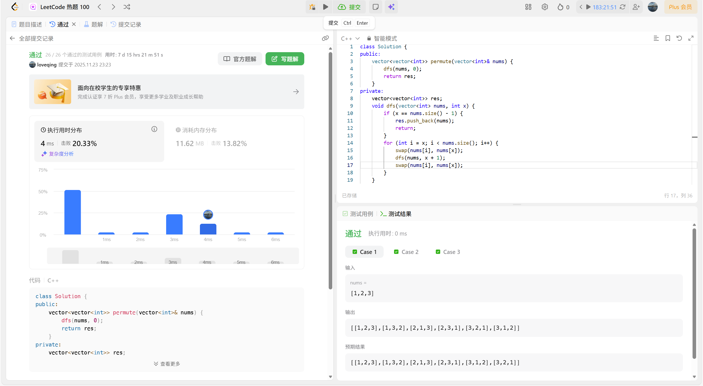

#### [78. 子集](https://leetcode.cn/problems/subsets/)

思路：子集是 “所有可能的元素组合（含空集）”，用回溯遍历 “选当前元素” 和 “不选当前元素” 两种分支，全程收集路径即得所有子集。

```c++
class Solution {
public:
    vector<vector<int>> subsets(vector<int>& nums) {
        int n = nums.size();
        vector<vector<int>> ans;
        vector<int> path;

        auto dfs = [&](this auto&& dfs, int i) -> void {
            ans.emplace_back(path);
            for (int j = i; j < n; j++) {
                path.push_back(nums[j]);
                dfs(j + 1);
                path.pop_back();
            }
        };

        dfs(0);
        return ans;
    }
};
```

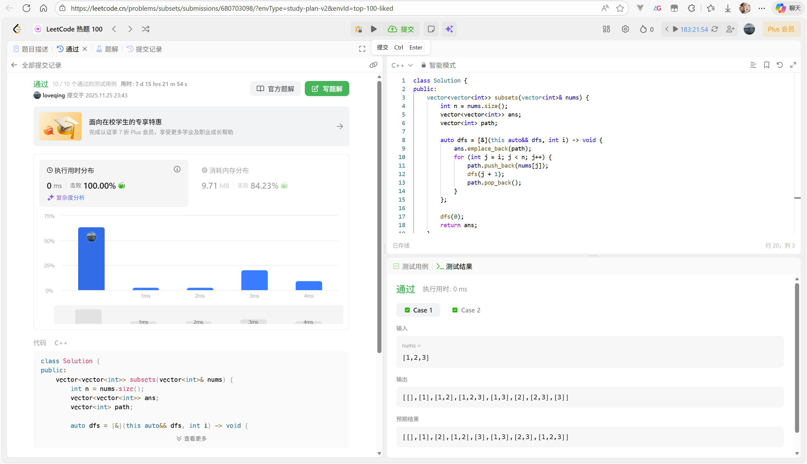

#### [17. 电话号码的字母组合](https://leetcode.cn/problems/letter-combinations-of-a-phone-number/)

思路：**通过深度优先搜索（DFS）结合回溯法，遍历所有可能的字母组合**：借助预定义的数字 - 字母映射表，从第一个数字开始，为每个数字依次选取其对应的字母填入路径，递归处理下一位数字；当路径长度等于数字串长度时，即生成一个完整组合并保存；遍历完当前数字的所有字母后自动回溯，继续探索其他组合可能，最终穷举所有合法的字母组合。

```c++
class Solution {
    static constexpr string MAPPING[10] = {"", "", "abc", "def", "ghi", "jkl", "mno", "pqrs", "tuv", "wxyz"};

public:
    vector<string> letterCombinations(string digits) {
        int n = digits.length();
        if (n == 0) {
            return {};
        }

        vector<string> ans;
        string path(n, 0);
        
        auto dfs = [&](this auto&& dfs, int i) -> void {
            if (i == n) {
                ans.emplace_back(path);
                return;
            }
            for (char c : MAPPING[digits[i] - '0']) {
                path[i] = c; // 直接覆盖
                dfs(i + 1);
            }
        };

        dfs(0);
        return ans;
    }
};
```

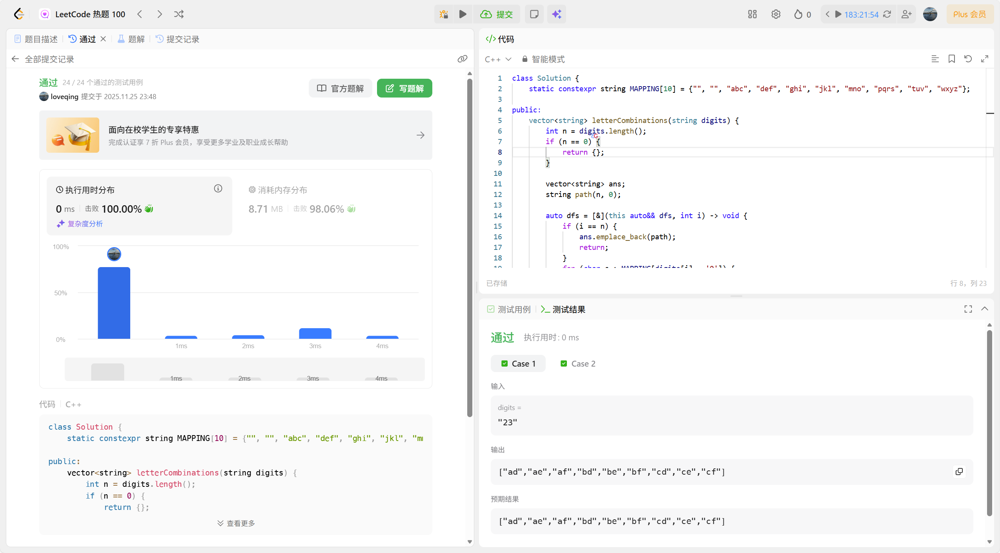

#### [39. 组合总和](https://leetcode.cn/problems/combination-sum/)

思路：枚举所有可能的组合，但需要避免重复组合。

1. **排序无关**：由于 `candidates` 无重复，且组合不考虑顺序通过「固定选择顺序」避免重复 —— 只从当前元素或其后的元素中选择（即不回头选前面的元素）；

2. 回溯框架

   每个元素有两个选择：

   - 不选当前元素：直接跳过，递归处理下一个元素；
   - 选当前元素：将其加入路径，递归处理「同一元素（可重复选）」，处理完后撤销选择（恢复现场）；

3. 终止条件

   - 当剩余目标值 `left == 0`：找到合法组合，将路径加入答案；
   - 当索引越界（`i == candidates.size()`）或剩余目标值为负（`left < 0`）：组合无效，直接返回。

```c++
class Solution {
public:
    vector<vector<int>> combinationSum(vector<int>& candidates, int target) {
        vector<vector<int>> ans;
        vector<int> path;

        auto dfs = [&](this auto&& dfs, int i, int left) {
            if (left == 0) {
                ans.push_back(path);
                return;
            }

            if (i == candidates.size() || left < 0) {
                return;
            }
            // 不选
            dfs(i + 1, left);
            // 选
            path.push_back(candidates[i]);
            dfs(i, left - candidates[i]);
            path.pop_back();
        };

        dfs(0, target);
        return ans;
    }
};
```

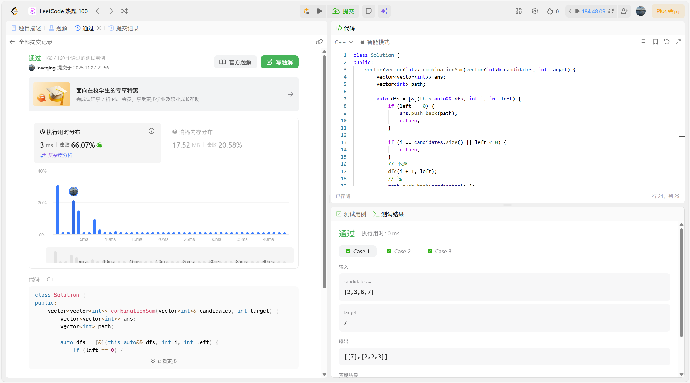

#### [22. 括号生成](https://leetcode.cn/problems/generate-parentheses/)

思路：枚举当前位置填左括号还是右括号，递归的过程中，要保证右括号的个数不能超过左括号的个数。如果现在右括号个数等于左括号个数，那么不能填右括号。如果现在右括号个数小于左括号个数，那么可以填右括号。由于左括号个数始终 ≥ 左括号个数，所以当我们填了 n 个右括号时，也一定填了 n 个左括号，此时填完所有 2n 个括号。

```c++
class Solution {
public:
    vector<string> generateParenthesis(int n) {
        vector<string> ans;
        string path(n * 2, ' ');
        
        function<void(int, int)> dfs = [&](int left, int right) {
            if (right == n) {
                ans.push_back(path);
                return;
            }
            if (left < n) {
                path[left + right] = '(';
                dfs(left + 1, right);
            }
            if (right < left) {
                path[left + right] = ')';
                dfs(left, right + 1);
            }
        };

        dfs(0, 0);
        return ans;
    }
};
```

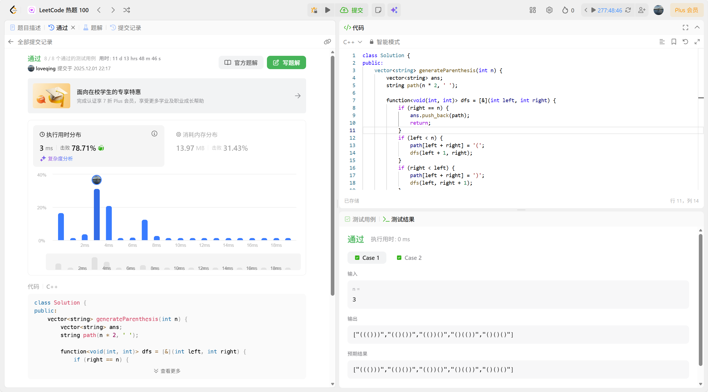

#### [79. 单词搜索](https://leetcode.cn/problems/word-search/)

思路：先遍历矩阵每个单元格作为 DFS 起点，对每个起点通过递归探索上下左右四个方向，递归中先校验当前矩阵字符是否与目标字符串对应位置匹配，若匹配且已到字符串末尾则匹配成功，若未到末尾则将当前单元格标记为已访问（避免重复使用）后继续探索四方向，若所有方向探索失败则回溯恢复当前单元格原字符（不影响后续起点探索），只要任一起点的 DFS 找到完整匹配路径就返回 true，所有起点均失败则返回 false。

```c++
class Solution {
    int dirs[4][2]= {{0, 1}, {0, -1}, {1, 0}, {-1, 0}};
public:
    bool exist(vector<vector<char>>& board, string word) {
        int m = board.size(), n = board[0].size();
        function<bool(int,int,int)>dfs;
        dfs = [&](int i, int j, int k) -> bool {
            if (board[i][j] != word[k]) { 
                return false;
            }
            if (k + 1 == word.length()) { 
                return true;
            }
            board[i][j] = 0; 
            for (int d=0;d<4;d++) {
                int x = i + dirs[d][0], y = j + dirs[d][1];
                if (0 <= x && x < m && 0 <= y && y < n && dfs(x, y, k + 1)) {
                    return true; 
                }
            }
            board[i][j] = word[k]; 
            return false;
        };
        for (int i = 0; i < m; i++) {
            for (int j = 0; j < n; j++) {
                if (dfs(i, j, 0)) {
                    return true;
                }
            }
        }
        return false;
    }
};
```


[131. 分割回文串](https://leetcode.cn/problems/palindrome-partitioning/)

思路：先枚举每个字符间的「分割 / 不分割」选择，从字符串起始位置开始，DFS 递归处理每个字符，若选择「不分割」则继续处理下一个字符且保持当前子串起始位置不变；若选择「分割」，则先校验当前子串是否为回文（双指针法实现回文子串校验辅助函数），若是则将该子串加入当前分割路径，再从下一个字符开始新的子串匹配，处理完后续字符后回溯移除当前子串以尝试其他分割方案；当递归处理完所有字符时，说明当前路径是合法的分割方案，将其加入结果集，最终返回所有合法分割方案。

```c++
class Solution {
private:
//检验是否是回文
    bool isPalindrome(const string& s, int left, int right) {
        while(left<right){
            if(s[left]!=s[right]){
            return false;
            }
            left++;
            right--;
        }
        return true;
    }
public:
    vector<vector<string>> partition(string s) {
        int strLen = s.size();
        vector<vector<string>> result; // 存储合法的分割方案
        vector<string> currentPath; // 存储当前正在尝试的分割路径
        function<void(int, int)> dfs;
        dfs = [&](int currentIdx,int substrStart){
             if (currentIdx == strLen) {
                result.push_back(currentPath); //加入结果集
                return;
            }
            //不分割
            if (currentIdx < strLen - 1) {
                dfs(currentIdx + 1, substrStart);
            }
            //分割
            if (isPalindrome(s, substrStart, currentIdx)) {
                //加入当前路径
                string palindromeSubstr = s.substr(substrStart, currentIdx - substrStart + 1);
                currentPath.push_back(palindromeSubstr);
                //处理下一个字符
                dfs(currentIdx + 1, currentIdx + 1);
                // 回溯
                currentPath.pop_back();
            }
        };
        dfs(0, 0);
        return result;
    }
};
```


#### [74. 搜索二维矩阵](https://leetcode.cn/problems/search-a-2d-matrix/)

思路：先确定矩阵的行数 `m` 和列数 `n`，把整个矩阵看作长度为 `m*n` 的一维有序数组，设置二分查找的左边界 `left=0`、右边界 `right=m*n-1`；在循环中计算中间下标 `mid`，利用 `mid/n` 得到二维矩阵中的行下标、`mid%n` 得到列下标，从而取出对应位置的元素与目标值比较，若元素等于目标值则直接返回 `true`，若元素大于目标值则调整右边界缩小到左半区间，若元素小于目标值则调整左边界缩小到右半区间；当循环结束（`left>right`）仍未找到目标值时，返回 `false`。

```c++
class Solution {
public:
    bool searchMatrix(vector<vector<int>>& matrix, int target) {
        int m = matrix.size(), n = matrix[0].size();
        int left = 0, right = m * n-1;
        while (left <= right) {
            int mid = left + (right - left) / 2;
            int x = matrix[mid / n][mid % n];
            if (x == target) {
                return true;
            }
            if (x > target){
                right = mid - 1;
            } else {
                left = mid + 1;
            }
        }
        return false;
    }
};
```

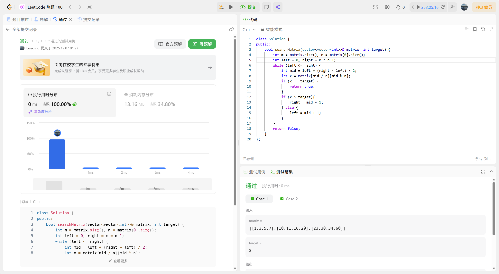

#### [34. 在排序数组中查找元素的第一个和最后一个位置](https://leetcode.cn/problems/find-first-and-last-position-of-element-in-sorted-array/)

思路：用`lower_bound`函数，通过二分法找到数组中第一个大于等于目标值的下标作为起始位置，若该位置越界或对应元素不等于目标值，则直接返回`{-1, -1}`表示目标值不存在；若存在，则再次调用`lower_bound`查找第一个大于等于`target+1`的下标，将其减 1 即为目标值的最后一个位置，最终返回起止下标组成的结果

```c++
class Solution {
    int lower_bound(vector<int>& nums, int target){
        int left = 0, right = nums.size()-1;
        while (left <= right) { 
            int mid = left + (right - left) / 2;
            if (nums[mid] >= target) {
                right = mid - 1; 
            } else {
                left = mid + 1;
            }
        }
        return left;
    }
public:
    vector<int> searchRange(vector<int>& nums, int target) {
        int start = lower_bound(nums, target);
        if (start == nums.size() || nums[start] != target) {
            return {-1, -1};
        }

        int end = lower_bound(nums, target + 1) - 1;
        return {start, end};
    }
};
```


#### [33. 搜索旋转排序数组](https://leetcode.cn/problems/search-in-rotated-sorted-array/)

思路：先通过二分法定位数组旋转点（即最小值下标），将原无序数组拆分为两个升序子区间，再根据目标值与数组末尾元素的大小关系，判断目标值所属的升序子区间，最后在对应子区间内用开区间二分查找精准定位目标值；其中`findMin`函数以数组末尾元素为锚点，通过收缩左右边界找到旋转点，`lower_bound`函数则在指定升序子区间内完成目标值查找

```c++
class Solution {
    int findMin(vector<int>& nums) {
        int left = -1, right = nums.size() - 1; // 开区间
        while (left + 1 < right) { 
            int mid = left + (right - left) / 2;
            if (nums[mid] < nums.back()) {
                right = mid;
            } else {
                left = mid;
            }
        }
        return right;
    }

    // 有序数组中找 target 的下标
    int lower_bound(vector<int>& nums, int left, int right, int target) {
        while (left + 1 < right) { 
            int mid = left + (right - left) / 2;
            if (nums[mid] >= target) {
                right = mid;
            } else {
                left = mid; 
            }
        }
        return nums[right] == target ? right : -1;
    }

public:
    int search(vector<int>& nums, int target) {
        int i = findMin(nums);
        if (target > nums.back()) { //第一段
            return lower_bound(nums, -1, i, target); 
        }
        //第二段
        return lower_bound(nums, i - 1, nums.size(), target); 
    }
};
```


#### [153. 寻找旋转排序数组中的最小值](https://leetcode.cn/problems/find-minimum-in-rotated-sorted-array/)

思路：用二分，初始化左边界为 - 1、右边界为数组最后一个元素下标，以数组末尾元素为锚点，通过循环收缩边界（若中间值小于末尾元素，说明最小值在左半区，将右边界移至中间位置；否则将左边界移至中间位置），直到区间内仅剩一个元素（left+1=right），此时右边界指向的元素即为数组最小值

```c++
class Solution {
public:
    int findMin(vector<int>& nums) {
        int left = -1, right = nums.size() - 1;
        while (left + 1 < right) {
            int mid = left + (right - left) / 2;
            (nums[mid] < nums.back() ? right : left) = mid;
        }
        return nums[right];
    }
};
```

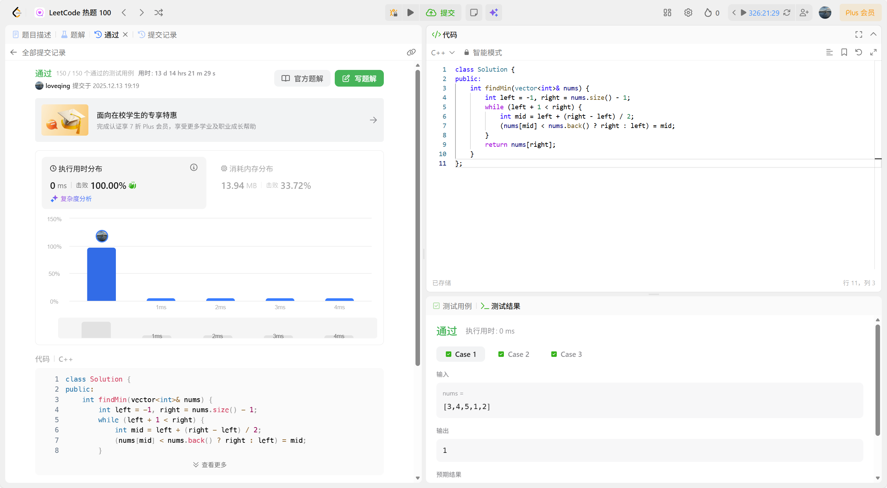

#### [155. 最小栈](https://leetcode.cn/problems/min-stack/)

思路：用一个栈存储 “当前值 + 栈内最小值” 的键值对，初始化时向栈中压入哨兵元素`(0, INT_MAX)`避免空栈判断，每次入栈时同步记录当前栈的最小值，出栈时自动丢弃对应最小值。`emplace` 是 STL 容器（如 `stack`、`vector`、`map` 等）提供的成员函数，核心作用是**在容器中直接构造元素**，而非先创建元素再拷贝 / 移动到容器中，相比 `push` 更高效。

```c++
class MinStack {
    stack<pair<int,int>> st;
public:
    MinStack() {
        st.emplace(0, INT_MAX);
    }
    
    void push(int val) {
        st.emplace(val, min(getMin(), val)); 
    }
    
    void pop() {
        st.pop();
    }
    
    int top() {
        return st.top().first;
    }
    
    int getMin() {
        return st.top().second;
    }
};

/**
 * Your MinStack object will be instantiated and called as such:
 * MinStack* obj = new MinStack();
 * obj->push(val);
 * obj->pop();
 * int param_3 = obj->top();
 * int param_4 = obj->getMin();
 */
```

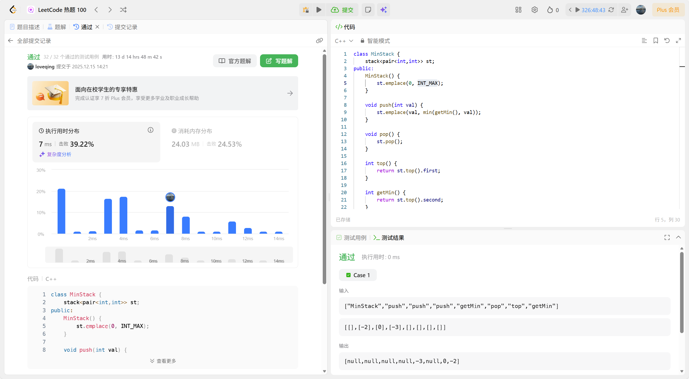

#### [394. 字符串解码](https://leetcode.cn/problems/decode-string/)

思路：用栈保存嵌套解码的上下文（前缀字符串 + 重复次数），逐字符处理实现解码：

1. **字母**：直接追加到当前字符串`res`；
2. **数字**：累积计算重复次数`k`（处理多位数）；
3. **左括号`[`**：将当前`res`和`k`入栈，重置`res`和`k`，准备处理括号内子串；
4. **右括号`]`**：出栈获取前缀和重复次数，将当前`res`（括号内子串）重复指定次数后，拼接到前缀上，更新为新的`res`；
5. 遍历结束后，`res`即为解码结果。

```c++
class Solution {
public:
    string decodeString(string s) {
         stack<pair<string, int>> stk;
        string res; 
        int k = 0; 
        
        for (char c : s) {
            if (isalpha(c)) {
                res += c;
            } else if (isdigit(c)) {
                k = k * 10 + (c - '0');
            } else if (c == '[') {
                stk.push(make_pair(move(res), k));
                k = 0;
                res.clear(); 
            } else { 
                pair<string, int> top_pair = stk.top();
                stk.pop();
                string pre_res = top_pair.first; 
                int pre_k = top_pair.second;  
                string repeated_str;
                for (int i = 0; i < pre_k; ++i) {
                    repeated_str += res;
                }
                res = pre_res + repeated_str;
            }
        }
        return res;
    }
};
```

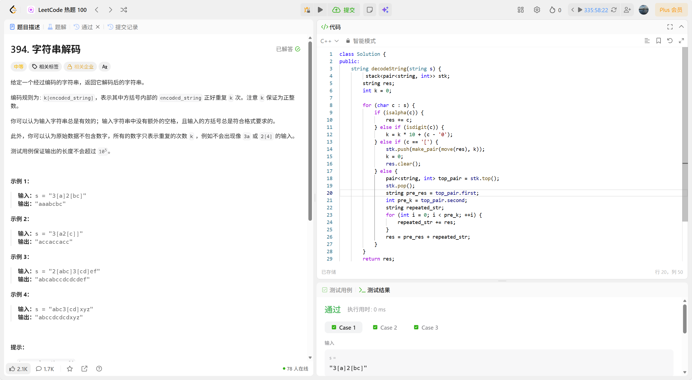

[739. 每日温度](https://leetcode.cn/problems/daily-temperatures/)

思路：先初始化与温度数组等长的结果数组`ans`，借助栈存储温度数组的索引（栈内索引对应温度保持单调递增）；从数组末尾向前遍历每个温度，若当前温度大于等于栈顶索引对应的温度，则持续弹出栈顶元素（这些元素无法成为当前位置的 “更暖天”），直到栈为空或找到更大温度的索引；此时若栈非空，当前位置的结果即为栈顶索引与当前索引的差值（即距离下一个更暖天的天数），若栈空则结果为 0；最后将当前索引压入栈，供前面的元素计算使用，遍历完成后`ans`数组即为每个位置对应下一个更暖天的天数。

```c++
class Solution {
public:
    vector<int> dailyTemperatures(vector<int>& temperatures) {
        int n = temperatures.size();
        vector<int> ans(n);
        stack<int> st;
        for (int i = n - 1; i >= 0; i--) {
            int t = temperatures[i];
            while (!st.empty() && t >= temperatures[st.top()]) {
                st.pop();
            }
            if (!st.empty()) {
                ans[i] = st.top() - i;
            }
            st.push(i);
        }
        return ans;
    }
};
```

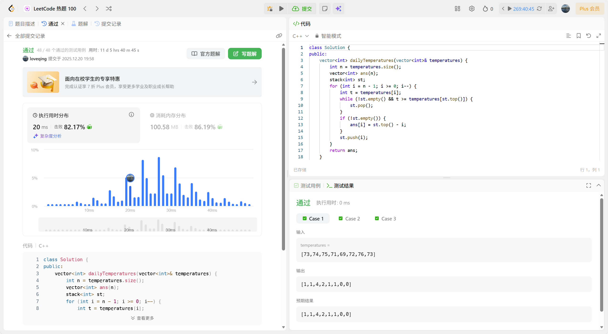

#### [215. 数组中的第K个最大元素](https://leetcode.cn/problems/kth-largest-element-in-an-array/)

思路：使用编程语言的内置排序算法对数组 `nums` 进行排序，然后返回第 *N*−*k* 个元素即可。

```c++
class Solution {
public:
    int findKthLargest(vector<int>& nums, int k) {
        sort(nums.begin(), nums.end());
        return nums[nums.size() - k];
    }
};
```

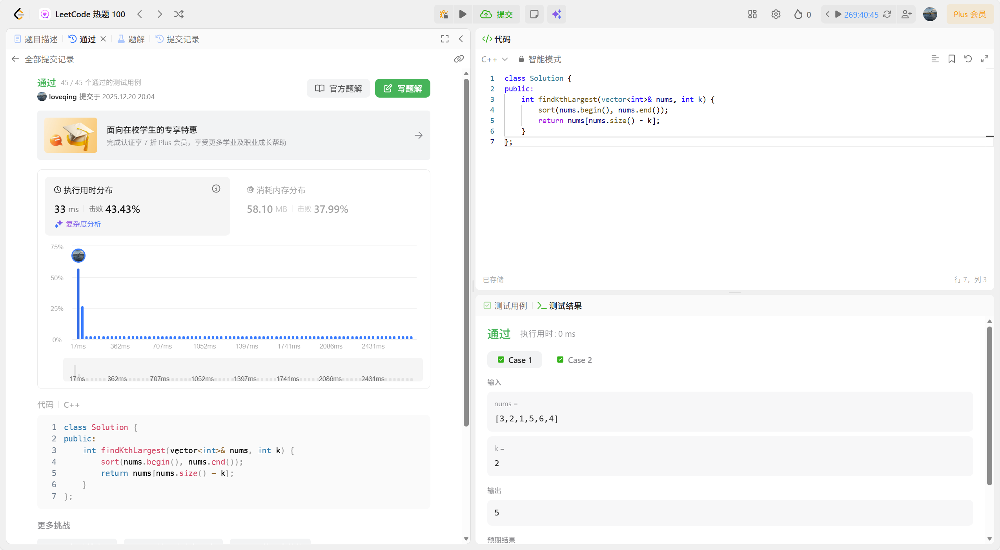

#### [75. 颜色分类](https://leetcode.cn/problems/sort-colors/)

思路：将数组划分为「0 的区域」「1 的区域」和「2 的区域」，通过两个标记位`p0`（0 区域的右边界）、`p1`（1 区域的右边界），在一次遍历中完成 0、1、2 的排序：

1. 初始化`p0`和`p1`均为 0，分别表示当前已排好的 0 的末尾位置、1 的末尾位置；
2. 遍历数组中的每个元素，先将当前位置的值强制设为 2（因为 2 是最大的数，最终应出现在数组末尾，先占位）；
3. 若原元素`x ≤ 1`，说明该位置实际应属于 1 的区域，因此将`p1`位置设为 1 并将`p1`右移，扩大 1 的区域；
4. 若原元素`x == 0`，说明该位置同时属于 0 的区域，因此将`p0`位置设为 0 并将`p0`右移，扩大 0 的区域；
5. 遍历结束后，数组中 0 会集中在`[0, p0)`区间，1 集中在`[p0, p1)`区间，2 集中在`[p1, 数组末尾)`区间，从而完成排序。

```c++
class Solution {
public:
    void sortColors(vector<int>& nums) {
        int p0 = 0, p1 = 0;
        for (int i = 0; i < nums.size(); i++) {
            int x = nums[i];
            nums[i] = 2;
            if (x <= 1) {
                nums[p1++] = 1;
            }
            if (x == 0) {
                nums[p0++] = 0;
            }
        }
    }
};
```

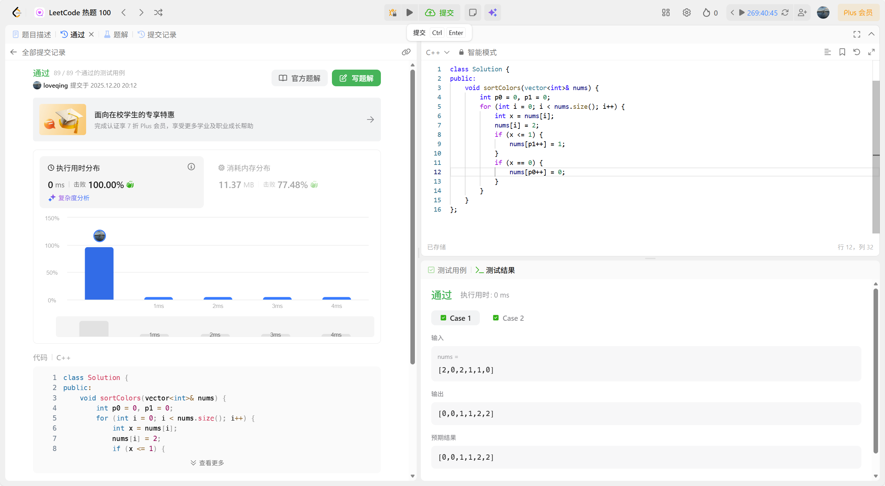

#### [347. 前 K 个高频元素](https://leetcode.cn/problems/top-k-frequent-elements/)

思路：通过哈希表统计数组中各元素的出现频率，因哈希表无法直接按频率排序，故将 “元素 - 频率” 键值对转存至二维数组，为排序做准备；随后通过自定义排序规则sort，按频率降序排列二维数组，使高频元素前置；最后直接提取排序后前 k 个元素，即可得到前 k 个高频元素的答案。

```c++
class Solution {
public:
    vector<int> topKFrequent(vector<int>& nums, int k) {
        unordered_map<int, int> freqMap;
        for (int num:nums) {
            freqMap[num]++;
        }

        vector<vector<int>> elemFreq; 
        for (auto it = freqMap.begin(); it != freqMap.end(); it++) {
            elemFreq.push_back({it->first, it->second});
        }

        // 按出现频率降序排列
        sort(elemFreq.begin(), elemFreq.end(), [](const vector<int>& a, const vector<int>& b) {
            return a[1] > b[1];
        });

        vector<int> res;
        for (int i = 0; i < k; i++) {
            res.push_back(elemFreq[i][0]);
        }

        return res;
    }
};
```

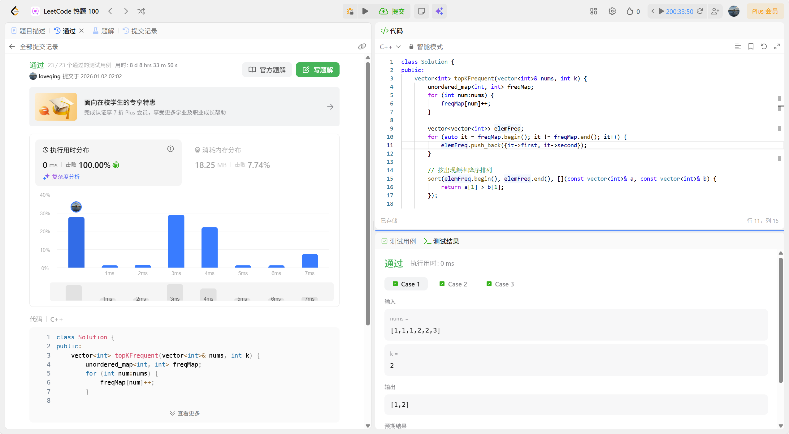

#### [55. 跳跃游戏](https://leetcode.cn/problems/jump-game/)

思路：从数组终点反向回溯，维护一个 “当前需要到达的目标位置”`idx`，初始时`idx`设为数组最后一个元素的索引，随后从终点前一个位置开始从后往前遍历数组，若当前位置`i`的最远可达位置（`nums[i]+i`）能覆盖`idx`，就将`idx`更新为`i`，这意味着只要能到达`i`就能间接到达原目标，遍历结束后只需判断`idx`是否等于起点索引`0`，若是则说明可以从起点跳到终点，返回`true`，否则返回`false`。

```c++
class Solution {
public:
    bool canJump(vector<int>& nums) {
        int n = nums.size();
        int idx = n - 1;
        for(int i = n - 2; i >= 0; i--)
        {
            if(nums[i] + i >= idx)
                idx = i;
        }
        if(idx == 0)
            return true;
        else
            return false;
    }
};
```

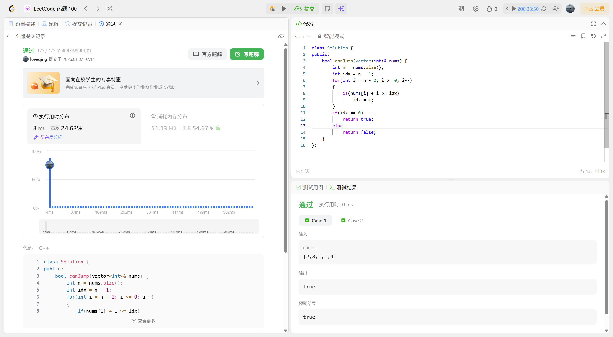

#### [45. 跳跃游戏 II](https://leetcode.cn/problems/jump-game-ii/)

思路：

1. `cur_left`（当前跳跃层级的左边界）、`cur_right`（当前跳跃层级的右边界）、`ans`（记录最少跳跃次数，初始为 0），其中当前层级的区间 `[cur_left, cur_right]` 表示 “通过 `ans` 次跳跃能到达的所有位置”；
2. 循环终止条件为 `cur_right < nums.size()-1`，即只要当前层级的最远右边界还未覆盖数组终点，就需要继续跳跃；
3. 每次循环先保存当前层级的边界 `l=cur_left`、`r=cur_right`，避免后续更新边界影响遍历；
4. 遍历当前层级的所有位置 `[l, r]`，计算每个位置 `i` 的最远可达位置 `nums[i]+i`，并不断更新 `cur_right` 为当前层级能延伸到的**最远右边界**（这是贪心的核心：每一次跳跃都要选择能跳得最远的位置，以最小化跳跃次数），同时代码中 `cur_left = i`（原代码笔误为 `cur_left -i`）的作用是更新下一层级的左边界为当前层级的右边界 + 1（本质是下一次跳跃的起始位置区间左端点）；
5. 当遍历完当前层级的所有位置，找到该层级能到达的最远右边界后，说明完成了一次有效跳跃，将 `ans` 加 1，进入下一层级的探索；
6. 当 `cur_right` 覆盖数组终点时，循环终止，返回 `ans` 即为最少跳跃次数。

```c++
class Solution {
public:
    int jump(vector<int>& nums) {
        int cur_right = 0,cur_left=0,ans=0; 

        while(cur_right < nums.size()-1){
            int l=cur_left,r=cur_right;
            
            for (int i = l; i <= r; i++) {
                if (nums[i]+i > cur_right) { 
                cur_right = nums[i]+i; 
                cur_left -i;
            }
        }
        ans++;
        }
        return ans;
    }
};
```

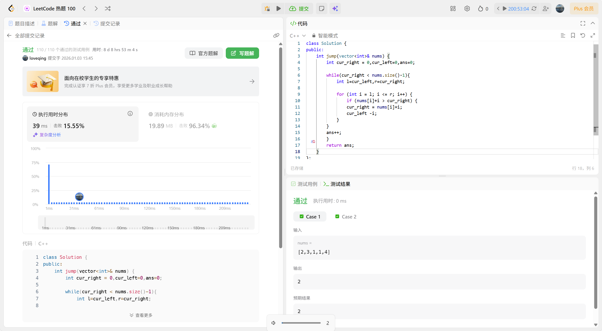

#### [763. 划分字母区间](https://leetcode.cn/problems/partition-labels/)

思路：

1. 先遍历一次字符串，用长度为 26 的数组 `last` 记录每个小写字母在 `s` 中**最后一次出现的索引位置**，为后续确定片段边界提供依据（因为 26 个小写字母是固定集合，该数组空间开销为常数级）；
2. 再次遍历字符串，维护两个变量 `start`（当前片段的起始索引）和 `end`（当前片段的最远结束索引），遍历过程中不断更新 `end` 为 “当前字符的最后出现位置” 和 “当前 `end`” 的较大值（确保当前片段包含所有已遍历字符的全部出现），当遍历到 `i == end` 时，说明当前片段已达到最大有效边界，记录该片段长度并更新 `start`，开始下一个片段的划分。

```c++
class Solution {
public:
    vector<int> partitionLabels(string s) {
        int n=s.size();
        int last[26];
        for(int i=0;i<n;i++){
            last[s[i]-'a'] = i;
        }

        vector<int> ans;
        int start =0,end = 0;
        for(int i=0 ; i<n ; i++){
            end = max(end,last[s[i]-'a']);
            if(end == i){
                ans.push_back(end-start+1);
                start = i+1;
            }
        }
        return ans;
    }
};
```

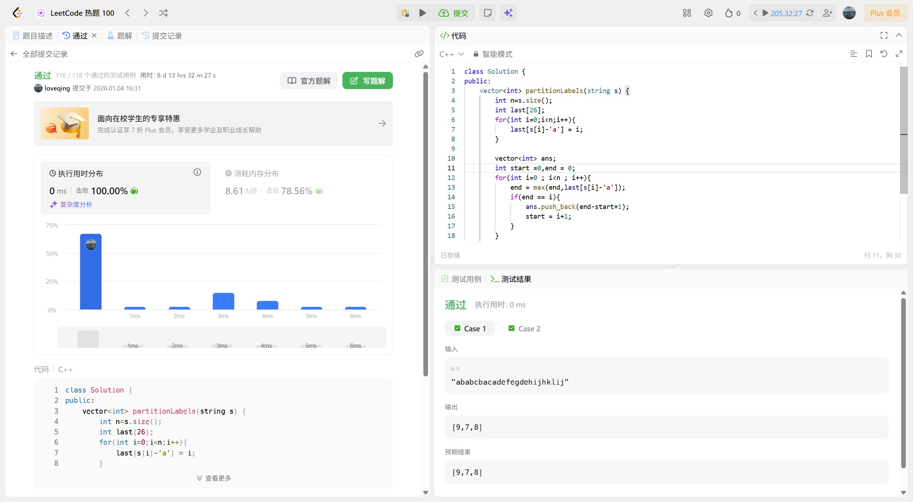

#### [198. 打家劫舍](https://leetcode.cn/problems/house-robber/)

思路：抓住 “不能抢相邻房屋” 的核心限制，确定用动态规划拆解子问题，接着定义`dp[i]`表示前`i+1`间房屋（索引`0~i`）能抢到的最大金额，再处理边界情况 ——1 间房时`dp[0]=nums[0]`，2 间房时`dp[1]=max(nums[0],nums[1])`，然后推导状态转移逻辑：遍历到第`i`间房（`i≥2`）时，有抢和不抢两种选择，不抢则继承前`i-1`间的最优解`dp[i-1]`，抢则只能叠加前`i-2`间的最优解`dp[i-2]`和当前房金额`nums[i]`，取两者最大值作为`dp[i]`，最后递推到最后一间房，`dp[n-1]`就是答案。

```c++
class Solution {
public:
    int rob(vector<int>& nums) {
        if(nums.size() == 0)
        return 0;
        
        if(nums.size() == 1)
        return nums[0];

        int n = nums.size();
        vector<int> dp(n,0);
        dp[0] = nums[0];
        dp[1] = max(nums[0],nums[1]);

        for(int i = 2; i < n ;i++){
            dp[i] = max(dp[i-1],dp[i-2]+nums[i]);
        }
        return dp[n-1];
    }
};
```


#### [279. 完全平方数](https://leetcode.cn/problems/perfect-squares/)

思路：完全背包问题的变形，完全平方数是可重复选取的“物品”，目标整数`n`是“背包容量”，解题核心是用动态规划求最少“物品数”；接着定义`dp[i]`表示组成整数`i`的最小完全平方数个数，创建长度为`n+1`的`dp`数组并初始化为`INT_MAX`，设置`dp[0]=0`作为边界条件；然后遍历所有不大于`√n`的正整数`num`（对应`num*num`这个完全平方数），再正序遍历0到`n`的整数`i`，当`i≥num*num`时，用`dp[i-num*num]+1`更新`dp[i]`的最小值；最终`dp[n]`就是所求答案。

```c++
class Solution {
public:
    int numSquares(int n) {
        vector<int> dp(n + 1, INT_MAX);
        dp[0] = 0;
        for (int num = 1; num <= sqrt(n); num++)
        {
            for (int i = 0; i <= n; i++)
            {
                if (i >= num * num)
                dp[i] = min(dp[i], dp[i - num * num] + 1);
            }
         }
    return dp[n];
    }
};
```

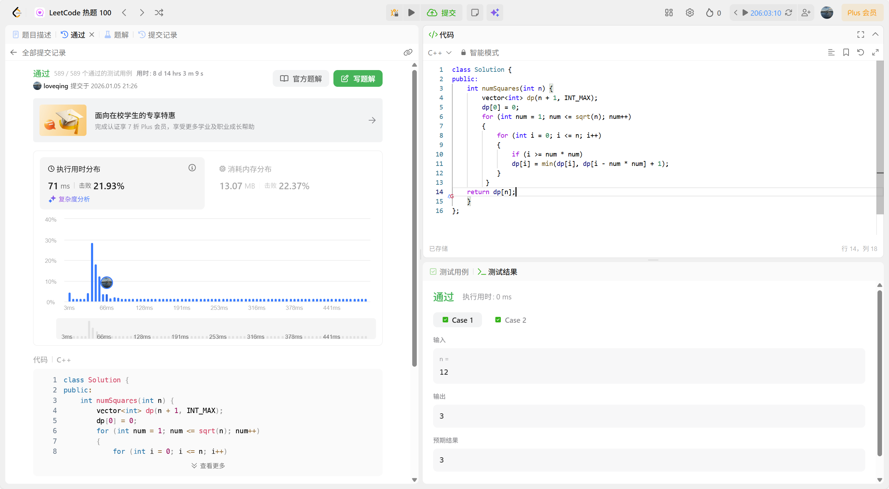

#### [322. 零钱兑换](https://leetcode.cn/problems/coin-change/)

思路：`dp[i]`表示凑成金额`i`所需的最小硬币数，先创建长度为`amount+1`的`long long`型`dp`数组并初始化为`INT_MAX`（表示初始状态下无法凑成对应金额），同时设置边界条件`dp[0]=0`（凑金额 0 不需要任何硬币）；接着先遍历每种硬币，再正序遍历所有金额（正序遍历允许硬币重复使用，符合完全背包特性），当当前硬币面值小于等于目标金额`i`时，通过状态转移方程`dp[i] = min(dp[i], dp[i-coin]+1)`更新最小值（`dp[i-coin]`是凑成`i-coin`的最小硬币数，加 1 对应添加当前这枚硬币）；最后判断`dp[amount]`是否仍为`INT_MAX`，若是则返回 - 1 表示无法凑成目标金额，否则返回`dp[amount]`即为最少硬币数。

```c++
class Solution {
public:
    int coinChange(vector<int>& coins, int amount) {
        vector<long long> dp(amount+1 , INT_MAX);
        dp[0] = 0;
        for(int coin : coins){
            for(int i = 0;i <= amount;i++){
                if(coin <= i){
                    dp[i] = min(dp[i] , dp[i-coin] + 1);
                }
            }
        }
        return dp[amount] == INT_MAX ? -1 : dp[amount];
    }
};
```

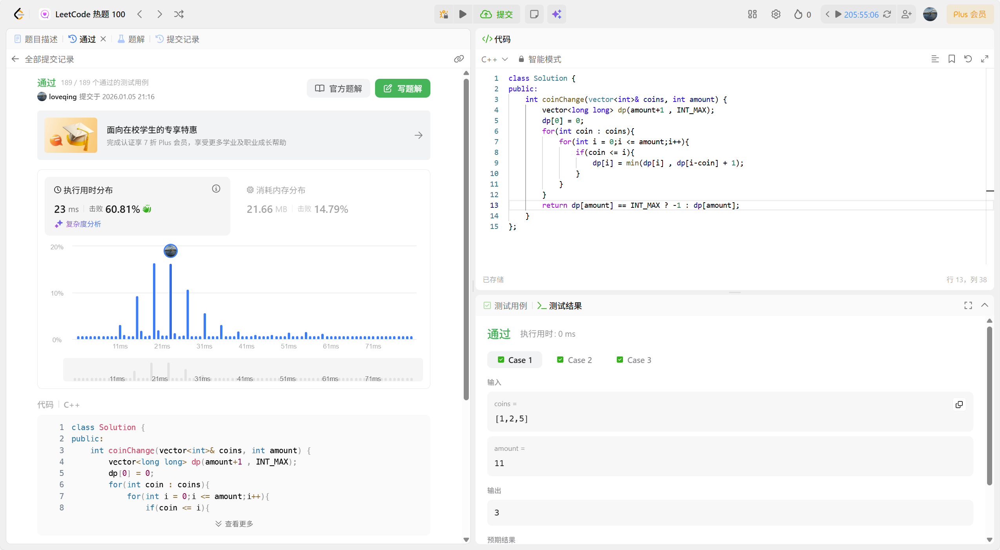

#### [139. 单词拆分](https://leetcode.cn/problems/word-break/)

思路： `dp[i]` 表示字符串 `s` 的前 `i` 个字符是否可以被拆分为字典中的单词， `dp[0] = true`（空字符串默认可拆分）；然后遍历字符串的每个位置 `i`，对于每个位置都遍历字典中的所有单词，若当前位置 `i` 是可拆分的（`dp[i] = true`），且从 `i` 开始截取与当前单词长度相同的子串和该单词完全匹配，就将 `dp[i + 单词长度]` 标记为 `true`（表示前 `i + 单词长度` 个字符可拆分）；最终通过 `dp[n]`（`n` 为字符串总长度）的值判断整个字符串是否能被拆分。

```c++
class Solution {
public:
    bool wordBreak(string s, vector<string>& wordDict) {
        int n = s.size();
        int m = wordDict.size();
        vector<bool> dp(n+1,false);
        dp[0] = true;
        int cur_len = 0;
        
        for(int i = 0;i < n;i++){

            for(int j =0;j < m;j++){
                // 获取当前单词的长度
                cur_len = wordDict[j].size();
                
                if(i + cur_len <= n && dp[i]){
                    string sub = s.substr(i,cur_len);
                    if(sub == wordDict[j]){
                        dp[i+cur_len] = true;
                    }   
                }
            }
        }
        return dp[n];
    }
};
```

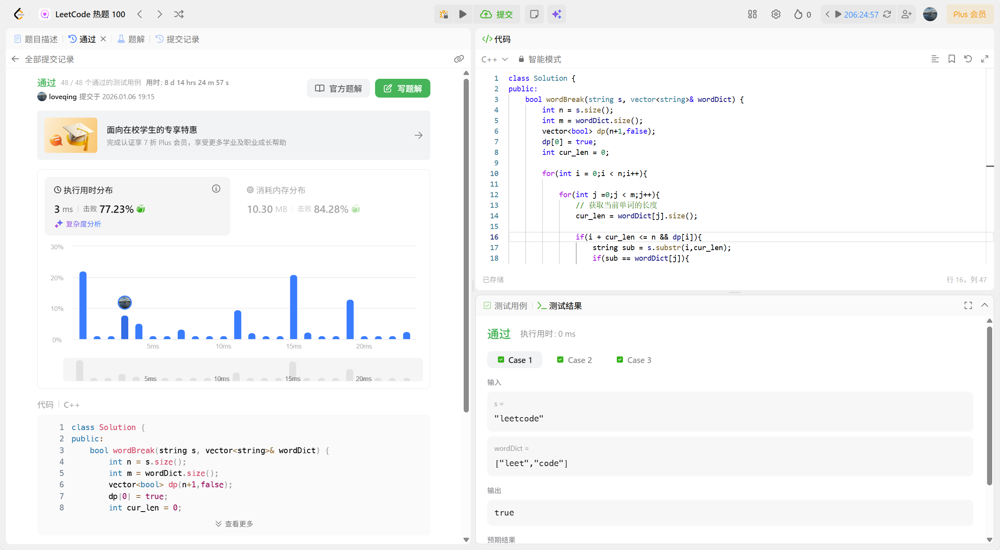

#### [300. 最长递增子序列](https://leetcode.cn/problems/longest-increasing-subsequence/)

思路：用 `dp[i]` 表示以数组第 `i` 个元素结尾的最长递增子序列的长度：首先初始化 `dp` 数组所有元素为 1，同时初始化最大长度 `max_len` 为 1；接着从第二个元素开始遍历数组，对于每个元素 `nums[i]`，向前遍历所有下标小于 `i` 的元素 `nums[j]`，若 `nums[j] < nums[i]`，说明可以将 `nums[i]` 接在以 `nums[j]` 结尾的递增子序列后，此时更新 `dp[i]` 为 `dp[i]` 和 `dp[j]+1` 中的较大值；遍历完所有元素后，再次遍历 `dp` 数组，找出其中的最大值，该值即为整个数组的最长递增子序列长度。

```c++
class Solution {
public:
    int lengthOfLIS(vector<int>& nums) {
        int n = nums.size();
        vector<int> dp(n, 1);
        int max_len = 1;
        for (int i = 1; i < n; i++) {
            for (int j = 0; j < i; j++) {
                if (nums[j] < nums[i]) {
                    dp[i] = max(dp[i], dp[j]+1);
                }
            }
        }

        for (int i = 0; i < n; i++) {
            max_len = max(max_len, dp[i]);
        }

        return max_len;
    }
};
```

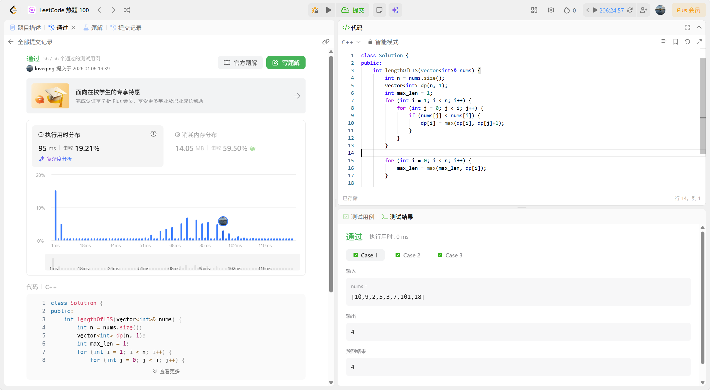

#### [152. 乘积最大子数组](https://leetcode.cn/problems/maximum-product-subarray/)

思路：由于负数相乘可能让原本的最小值变为最大值，因此不能仅维护以当前元素结尾的子数组最大乘积，还需同步维护最小乘积；定义`dp_max[i]`为以第`i`个元素结尾的子数组最大乘积、`dp_min[i]`为对应最小乘积，状态转移时，两者均需从「当前元素本身」「前一轮最大乘积 × 当前元素」「前一轮最小乘积 × 当前元素」三者中取极值（`dp_max[i]`取最大、`dp_min[i]`取最小）；用两个变量滚动记录当前的最大、最小乘积，同时用一个变量记录遍历过程中的全局最大乘积；最后处理空数组返回 0、单元素数组返回自身的边界条件，遍历数组完成状态更新后，全局最大乘积即为答案。

```c++
class Solution {
public:
    int maxProduct(vector<int>& nums) {
        int n = nums.size();
        if(n == 0){
            return 0;
        } else if(n == 1) {
            return nums[0];
        }
        int p = nums[0];
        int maxP = nums[0];
        int minP = nums[0];
        for(int i = 1; i < n; i++) {
            int t = maxP;
            maxP = max(max(maxP * nums[i], nums[i]), minP *nums[i]);
            minP = min(min(t * nums[i], nums[i]), minP * nums[i]);
            p = max(maxP, p);
        }
        return p;
    }
};
```

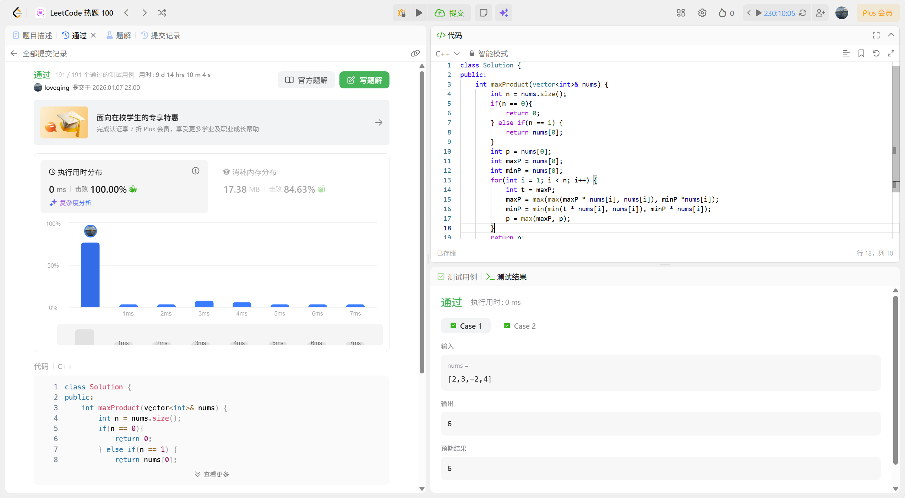

#### [416. 分割等和子集](https://leetcode.cn/problems/partition-equal-subset-sum/)

思路：**01 背包问题**：判断是否能选取若干数组成总和的一半。首先计算数组所有元素的总和，若总和为奇数则直接返回 false；若总和为偶数，初始化一个bool类型的一维 DP 数组，其中 dp [j] 表示能否组成和为 j 的子集，初始时仅 dp [0] 为 true（空集可组成和为 0 的子集）。随后遍历数组中的每个元素，对每个元素采用倒序遍历容量（从 target 到当前元素值）的方式更新 DP 数组，更新规则为 dp [j] = dp [j] || dp [j - num]（即对于和为 j 的子集，要么不选当前元素保持原有状态，要么选当前元素并判断 j-num 能否被组成，只要二者有一个为 true 则 dp [j] 为 true），最终通过 dp [target] 的值判断是否能组成目标和，即是否可将数组分割为两个和相等的子集。

```c++
class Solution {
public:
    bool canPartition(vector<int>& nums) {
        int sum = 0;
        for(int i = 0;i < nums.size(); i++){
            sum += nums[i];
        }
        if (sum % 2 != 0) {
            return false;
        }

        int target = sum/2;
        vector<bool> dp(target+1, false);
        dp[0] = true;
        for(int num : nums){
            for(int j = target; j >= num; j--){
                    dp[j] = dp[j] || dp[j-num];
            }
        }
        return dp[target];
    }
};
```

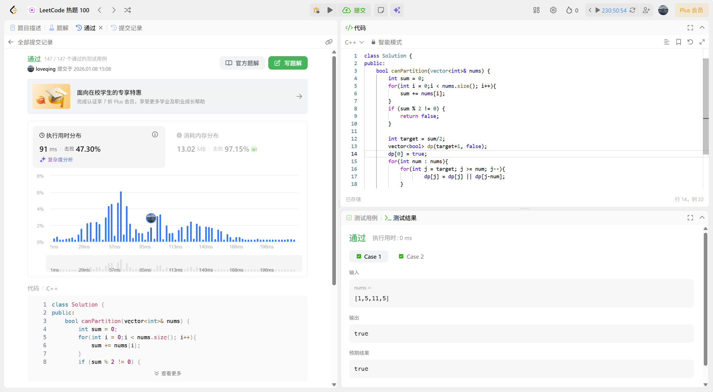

#### [62. 不同路径](https://leetcode.cn/problems/unique-paths/)

思路：一个 m 行 n 列的二维 DP 数组，其中 dp[i] [j] 表示从左上角到达 (i,j) 位置的路径数，由于第一行所有位置只能从左侧连续向右移动到达、第一列所有位置只能从上方连续向下移动到达，因此将 DP 数组的第一行和第一列所有元素初始化为 1；接着从第二行第二列开始遍历网格，每个位置的路径数遵循状态转移方程 dp [i] [j] = dp [i-1] [j] + dp [i] [j-1]（即到达当前位置的路径数等于从上方位置到达的路径数加上从左侧位置到达的路径数）；最终返回 DP 数组右下角元素 dp [m-1] [n-1]，即为从左上角到右下角的总不同路径数。

```c++
class Solution {
public:
    int uniquePaths(int m, int n) {
         vector<vector<int>> dp(m, vector<int>(n, 0));
         for (int i = 0; i < m; i++) {
            dp[i][0] = 1;
        }
        for (int j = 0; j < n; j++) {
            dp[0][j] = 1;
        }
        for (int i = 1; i < m; i++) {
            for (int j = 1; j < n; j++) {
                dp[i][j] = dp[i-1][j] + dp[i][j-1];
            }
        }
        return dp[m-1][n-1];
    }
};
```

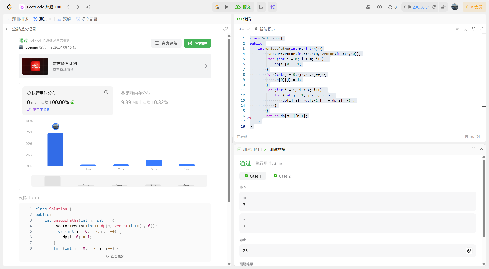

#### [64. 最小路径和](https://leetcode.cn/problems/minimum-path-sum/)

思路：`dp[i][j]`为到达网格中第`i`行第`j`列位置（对应原网格`grid[i-1][j-1]`）的最小路径和，为了避免处理边界条件的复杂情况，将`dp`数组的大小设为`(m+1)×(n+1)`并初始化为极大值`INT_MAX`，同时将`dp[0][1]`设为 0 作为路径和的起始基准；遍历原网格的每个位置，对于每个位置`(i,j)`（对应`dp[i+1][j+1]`），由于只能从上方`dp[i][j+1]`或左方`dp[i+1][j]`到达该位置，因此取这两个方向中路径和较小的值，加上当前网格位置的数值`grid[i][j]`，即为到达该位置的最小路径和；最终遍历完成后，`dp[m][n]`就存储了从网格左上角到右下角的最小路径和，直接返回该值即可。

```c++
class Solution {
public:
    int minPathSum(vector<vector<int>>& grid) {
        int m = grid.size(), n = grid[0].size();
        vector<vector<int>> dp(m+1, vector<int>(n+1, INT_MAX));
        dp[0][1] = 0;
        for(int i = 0; i < m; i++){
            for(int j = 0;j < n;j++){
                dp[i+1][j+1] = min(dp[i+1][j],dp[i][j+1]) + grid[i][j];
            }
        }
        return dp[m][n];
    }
};
```

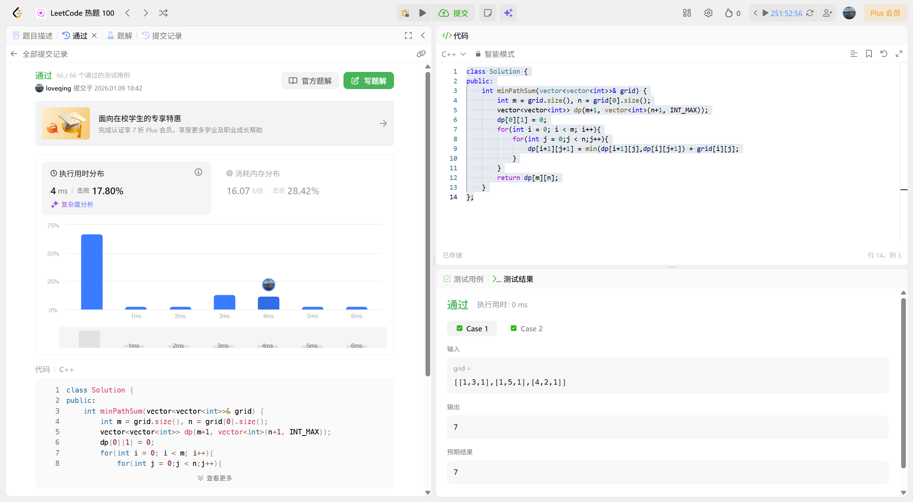

#### [5. 最长回文子串](https://leetcode.cn/problems/longest-palindromic-substring/)

思路：通过一个二维数组`dp[i][j]`记录字符串中从下标`i`到`j`的子串是否为回文串。先初始化最长回文子串的起始位置`start`为 0、最大长度`maxlen`为 1（单个字符本身就是回文）；然后从字符串末尾向前遍历左边界`i`，再从`i`开始向后遍历右边界`j`，判断`s[i]`和`s[j]`是否相等，且满足 “子串长度≤2（如单个字符或两个相同字符）” 或 “内部子串`dp[i+1][j-1]`是回文” 这两个条件之一时，标记`dp[i][j]`为回文，更新最长回文子串的起始位置和长度；根据记录的`start`和`maxlen`截取并返回最长回文子串。

```c++
class Solution {
public:
    string longestPalindrome(string s) {
        vector<vector<int>> dp(s.size(), vector<int>(s.size(), false));
        int start = 0, maxlen = 1;
        for (int i = s.size() - 1; i >= 0; i--) {
            for (int j = i; j < s.size(); j++) {
                if (s[i] == s[j] && (j - i <= 1 || dp[i + 1][j - 1])) {
                    dp[i][j] = true;
                    if (j - i + 1 >= maxlen) {
                        start = i;
                        maxlen = j - i + 1;
                    }
                }
            }
        }
        return s.substr(start, maxlen);
    }
};
```

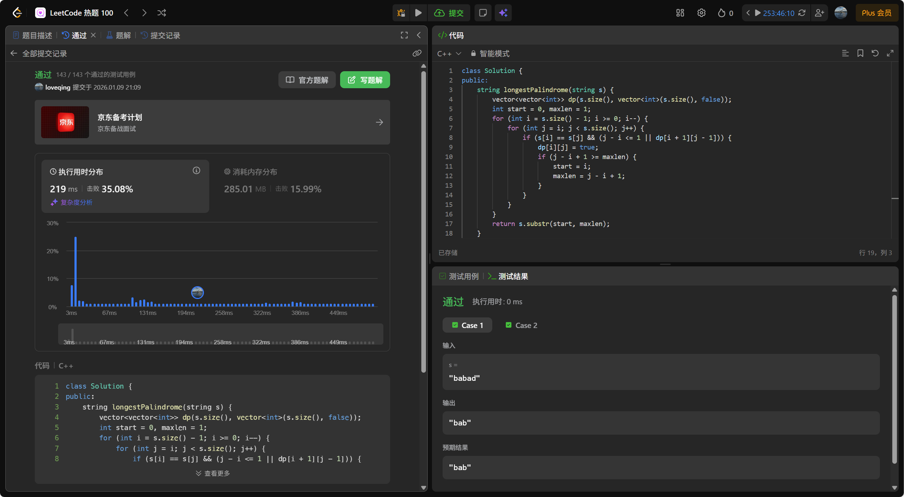

#### [1143. 最长公共子序列](https://leetcode.cn/problems/longest-common-subsequence/)

思路：`dp[i][j]`表示字符串`text1`的前`i`个字符和`text2`的前`j`个字符的最长公共子序列长度；为避免边界越界，将`dp`数组初始化为`(m+1)×(n+1)`的维度（`m`、`n`分别为两个字符串长度），且所有元素初始值为 0（空字符串与任意字符串的 LCS 长度为 0）。通过两层循环遍历（起始值为1，避免-1，越界）两个字符串的所有字符组合，若当前比较的`text1[i-1]`与`text2[j-1]`字符相等，说明该字符可加入公共子序列，因此`dp[i][j]`等于左上角`dp[i-1][j-1]`的值加 1；若字符不相等，则取 “不包含`text1`当前字符的结果（`dp[i-1][j]`）” 和 “不包含`text2`当前字符的结果（`dp[i][j-1]`）” 中的较大值作为`dp[i][j]`的值。最终，`dp[m][n]`即为两个完整字符串的最长公共子序列长度。

```c++
class Solution {
public:
    int longestCommonSubsequence(string text1, string text2) {
        int m = text1.size();
        int n = text2.size();
        vector<vector<int>> dp(m + 1, vector<int>(n + 1, 0));
        for(int i = 1; i <= m; i++){
            for(int j = 1; j <= n; j++){
                if(text1[i-1] == text2[j-1]){
                    dp[i][j] = dp[i-1][j-1] + 1;
                }else{
                    dp[i][j] = max(dp[i-1][j],dp[i][j-1]);
                }
            }
        }
        return dp[m][n];
    }
};
```

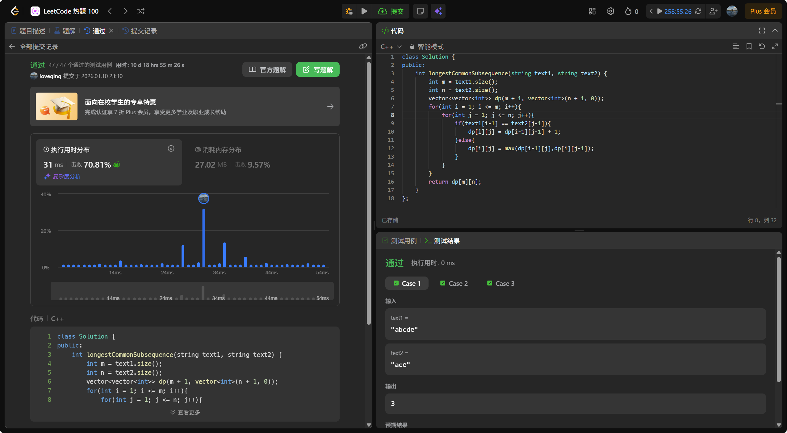

#### [72. 编辑距离](https://leetcode.cn/problems/edit-distance/)

思路：用`dp[i][j]`表示将`word1`的前`i`个字符转换成`word2`的前`j`个字符所需的最少操作数；初始化边界条件 ——`dp[i][0] = i`（将`word1`前`i`个字符转为空字符串需删除`i`次）、`dp[0][j] = j`（将空字符串转为`word2`前`j`个字符需插入`j`次）；然后通过两层循环遍历两个字符串的所有字符组合，若当前比较的`word1[i-1]`与`word2[j-1]`字符相等，无需任何操作，`dp[i][j]`直接继承`dp[i-1][j-1]`的值；若字符不相等，则取替换（`dp[i-1][j-1]`）、删除（`dp[i-1][j]`）、插入（`dp[i][j-1]`）三种操作前置的最小值，再加 1（当前操作的代价）作为`dp[i][j]`的值；最终`dp[m][n]`即为将完整的`word1`转为完整的`word2`的最小编辑距离。

```c++
class Solution {
public:
    int minDistance(string word1, string word2) {
        int m = word1.size();
        int n = word2.size();
        vector<vector<int>> dp(m+1,vector<int>(n+1 , 0));
        for (int i = 0; i <= m; i++) {
            dp[i][0] = i;
        }
         for (int j = 0; j <= n; j++) {
            dp[0][j] = j;
        }
        for (int i = 1; i <= m; i++) {
            for (int j = 1; j <= n; j++) {
                 if (word1[i - 1] == word2[j - 1]) {
                    dp[i][j] = dp[i - 1][j - 1];
                } else {
                    dp[i][j] = min(dp[i - 1][j - 1], min(dp[i - 1][j], dp[i][j - 1])) + 1;
                }
            }
        }
        return dp[m][n];
    }
};
```

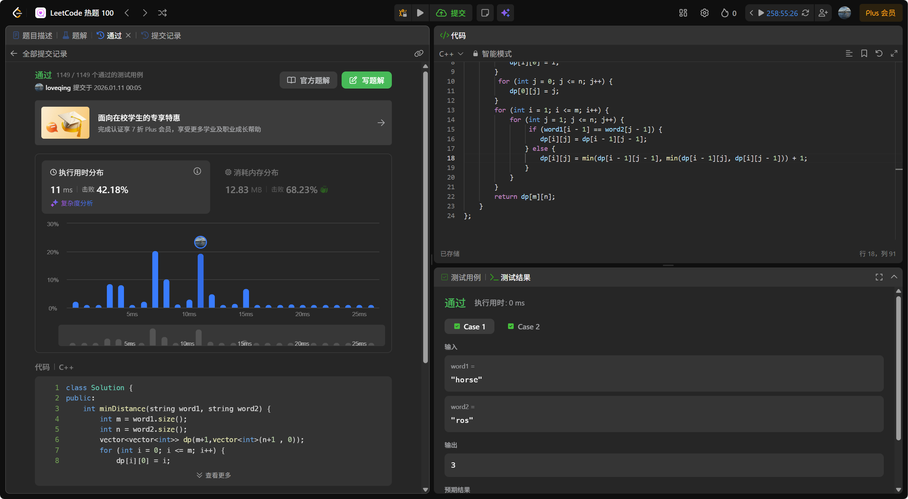

#### [31. 下一个排列](https://leetcode.cn/problems/next-permutation/)

思路：**在保持 “下一个”（比原排列大）的前提下，让增量尽可能小**。先从数组末尾向前遍历，找到第一个满足 `nums[i] < nums[i+1]` 的位置 `i`（这是原排列中可以 “增大” 的最小位置）；若找到该位置 `i`，则再从数组末尾向前找第一个比 `nums[i]` 大的元素 `nums[j]`，交换 `nums[i]` 和 `nums[j]`（此时 `i` 位置已增大，且是最小的增大方式）；最后将 `i+1` 到数组末尾的元素反转（因为交换后 `i+1` 到末尾是降序，反转后变为升序）；若未找到位置 `i`（说明原排列已是最大排列），则直接反转整个数组，回到最小排列。

```c++
class Solution {
public:
    void nextPermutation(vector<int>& nums) {
        int n = nums.size();
        int i = n-2;
        while(i>=0 && nums[i] >= nums[i+1]){
            i--;
        }
        if(i >= 0){
            int j = n-1;
            while(nums[j] <= nums[i]){
                j--;
            }
            swap(nums[i],nums[j]);
        }
        reverse(nums.begin() + i + 1, nums.end());
    }
};
```

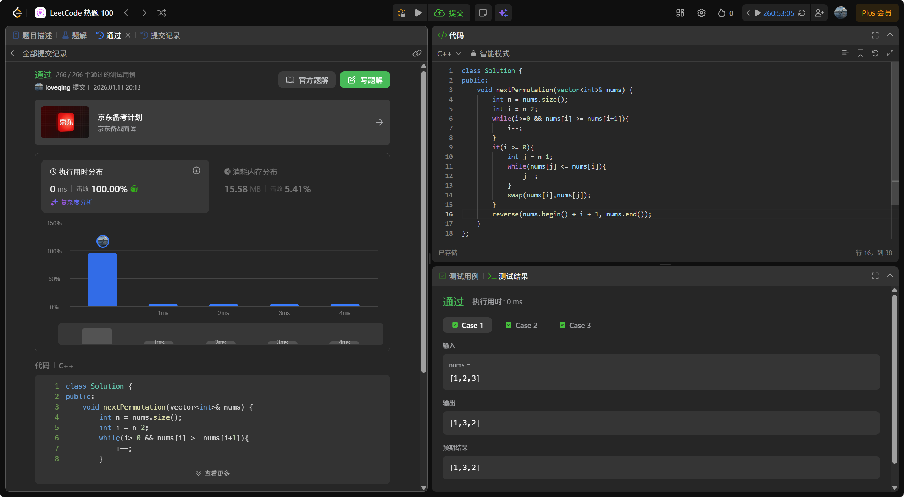

#### [287. 寻找重复数](https://leetcode.cn/problems/find-the-duplicate-number/)

思路：先确定查找范围是 `[1, nums.size()-1]`，在每轮循环中取中间值 `mid`，统计数组中落在 `[min, mid]` 区间内的数字个数 `cnt`若该区间内数字最大容量（`mid - min + 1`）小于实际统计数 `cnt`，说明重复数字一定在 `[min, mid]` 区间内，因此将查找范围的上界 `max` 调整为 `mid`；反之则说明重复数字在 `[mid+1, max]` 区间内，将下界 `min` 调整为 `mid+1`；不断缩小查找范围，直到 `min` 与 `max` 重合，此时的数值即为数组中重复的数字。

```c++
class Solution {
public:
    int findDuplicate(vector<int>& nums) {
        int min = 1; // 查找数范围的最小值
        int max = nums.size();//最大值
         while (min < max) {
            int mid = (min + max) / 2;
            // 计数
            int cnt = 0;
            for (int v : nums) {
                if (v >= min && v <= mid) {
                    cnt++;
                }
            }
            if (cnt > mid - min + 1) 
                max = mid;
            else
                min = mid + 1;
        }
        return min;
    }
};
```


#### [42. 接雨水](https://leetcode.cn/problems/trapping-rain-water/)

思路：用左右双指针从数组两端向中间遍历，同时维护左指针左侧的最大高度（leftCeil）和右指针右侧的最大高度（rightCeil），用于“每个位置接水量由左右两侧最高挡板中较矮的一个决定”的规则，每一步判断leftCeil和rightCeil的大小：若leftCeil更小，则左指针位置的接水量仅由leftCeil决定（因为右侧真实最大高度必然≥rightCeil>leftCeil），计算该位置水量后右移左指针；反之则右指针位置的接水量由rightCeil决定，计算后左移右指针。在一次遍历中累加得到总接水量。

```c++
class Solution {
public:
    int trap(vector<int>& height) {
        int l = 0, r = height.size() - 1;
        int cap = 0;
        int leftCeil = 0, rightCeil = 0;

        while (l <= r) {
            leftCeil = max(leftCeil, height[l]);
            rightCeil = max(rightCeil, height[r]);

            if (leftCeil < rightCeil)
                cap += leftCeil - height[l++]; // 增加水量并使 l 右移
            else
                cap += rightCeil - height[r--]; // 增加水量并使 r 左移
        }

        return cap;
    }
};
```

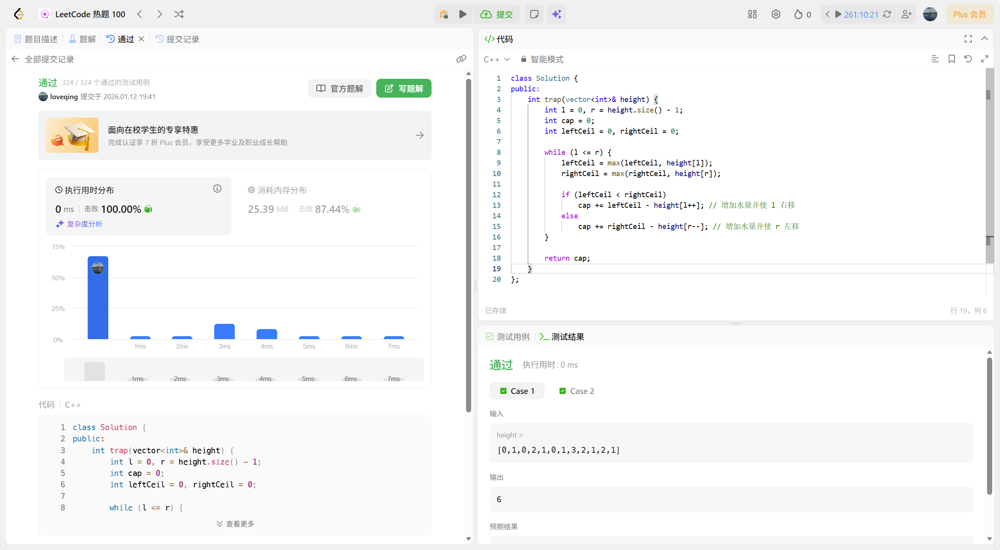

#### [239. 滑动窗口最大值](https://leetcode.cn/problems/sliding-window-maximum/)

思路：遍历数组时以当前元素下标i作为窗口右边窗口左边界left=i-k+1；接着通过循环移除双端队列尾部所有对应数值小于当前元素的下标，确保队列q内下标对应的数值呈单调递减，再加入下一个下标i加入队列；随后移除队列头部超出左边界left的无效下标，保证队列内所有下标均在当前窗口范围内；当窗口完全形成（left≥0）时，队列头部即为当前窗口最大值的下标，将其对应数值存入结果数组对应位置。在一次遍历中快速定位每个窗口的最大值。

```c++
class Solution {
public:
    vector<int> maxSlidingWindow(vector<int>& nums, int k) {
        int n = nums.size();
        vector<int> ans(n - k + 1);
        deque<int> q;
        for( int i = 0; i < n; i++){
            int left = i-k+1;
            while(!q.empty() && nums[q.back()] <= nums[i]){
                q.pop_back();
            }
            q.push_back(i);

            if(q.front() < left){
                q.pop_front();
            }

            if(left >= 0){
                ans[left] = nums[q.front()];
            }
        }
        return ans;
    }
};
```

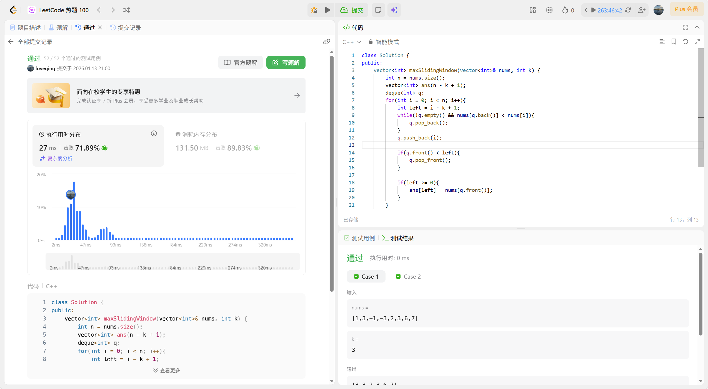

#### [76. 最小覆盖子串](https://leetcode.cn/problems/minimum-window-substring/)

思路：`int ans_left = -1 ,ans_right = m;`用来记录最短子串的左右端点，`int cnt_s[128]{}; int cnt_t[128]{};`两个计数数组，统计字符串 t 中各字符的出现次数；枚举 s 子串的右端点 right（子串最后一个字母的下标）,当窗口满足 “s 的字符计数全不少于 t”（通过 is_covered 函数校验）时，进入循环收缩左边界以寻找最小窗口：若当前窗口更小则更新结果的左右边界，随后减少左边界字符的计数并右移左指针；遍历结束后，若找到有效窗口则返回对应子串，否则返回空字符串。

```c++
class Solution {
    //判断是否覆盖了子串（集合 s 包含的所有字母数量，是否都不少于集合 t 的对应字母数量）
     bool is_covered(int cnt_s[], int cnt_t[]) {
        for (int i = 'A'; i <= 'Z'; i++) {
            if (cnt_s[i] < cnt_t[i]) {
                return false;
            }
        }
        for (int i = 'a'; i <= 'z'; i++) {
            if (cnt_s[i] < cnt_t[i]) {
                return false;
            }
        }
        return true;
     }
public:
    string minWindow(string s, string t) {
        // 统计s窗口内字符次数
        int cnt_s[128]{};
        // 统计t的字符次数
        int cnt_t[128]{};
        for(char c : t){
            cnt_t[c]++;
        }

        int m = s.size();
        int ans_left = -1 ,ans_right = m;
        int left = 0;
        for(int right = 0; right < m; right++){
            cnt_s[s[right]]++;//扩大窗口
            
            while(is_covered(cnt_s,cnt_t)){
                if(right - left < ans_right - ans_left){
                    ans_left = left;
                    ans_right = right;
                }
                cnt_s[s[left]]--;
                left++;//收缩窗口
            }
        }
        return ans_left == -1 ? "" : s.substr(ans_left, ans_right - ans_left + 1);;
    }
};
```


#### [41. 缺失的第一个正数](https://leetcode.cn/problems/first-missing-positive/)

思路：遍历数组，通过 while 循环将 [1, 数组长度] 范围内的数归位到一一对应的下标（ x-1 ）处，若遇到非正整数、超出数组长度的数或目标位置已存在正确数值则终止置换；对应完成后，再次遍历数组，第一个数值与下标 + 1 不匹配的位置，其下标 + 1 即为缺失的最小正整数；若所有位置均匹配，则缺失的是数组长度 + 1。

```c++
class Solution {
public:
    int firstMissingPositive(vector<int>& nums) {
      for(int i = 0; i < nums.size(); i++){
        while(nums[i] != i+1){
            if(nums[i] <= 0 || nums[i] > nums.size() || nums[i] == nums[nums[i]-1]){
                break;
            }
            int index = nums[i] - 1;
            nums[i] = nums[index];
            nums[index] = index + 1;
        }
      }  
      for(int i = 0; i < nums.size(); i++){
        if(nums[i] != (i+1)){
            return (i+1);
        }
      }
      return nums.size() + 1;
    }
};
```

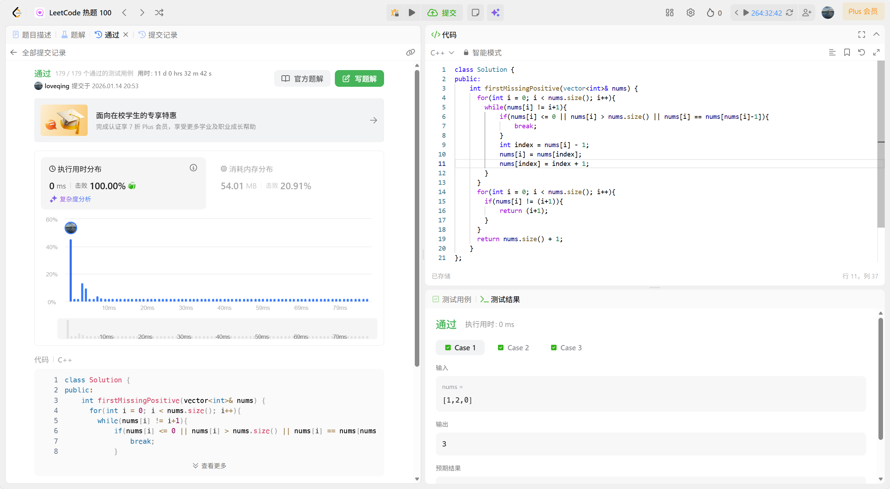

#### [84. 柱状图中最大的矩形](https://leetcode.cn/problems/largest-rectangle-in-histogram/)

思路：通过单调栈的单调性分别求解每个柱子左右两侧第一个高度更小的柱子下标，左侧柱子先从左到右遍历，利用栈弹出所有高度≥当前柱子的下标，确定左侧第一个更小柱子下标（left 数组）并将当前下标入栈；右侧柱子从右到左遍历，确定右侧第一个更小柱子下标（right 数组）；最后遍历每个柱子，以其高度为矩形高度、左右更小柱子下标间距减 1 为宽度计算面积，取所有面积的最大值即为结果。

```c++
class Solution {
public:
    int largestRectangleArea(vector<int>& heights) {
        int n = heights.size();
        vector<int> left(n,-1);
        stack<int> st;
        for(int i = 0;i < n; i++){
            int h = heights[i];
            while(!st.empty() && heights[st.top()] >= h){
                st.pop();
            }
            if(!st.empty()){
                left[i] = st.top();
            }
            st.push(i);
        }
        vector<int> right(n,n);
        stack<int> st1;
        for(int i = n-1;i >= 0; i--){
            int h = heights[i];
            while(!st1.empty() && heights[st1.top()] >= h){
                st1.pop();
            }
            if(!st1.empty()){
                right[i] = st1.top();
            }
            st1.push(i);
        }
        int ans = 0;
        for(int i = 0;i < n; i++){
            ans = max(ans, heights[i]*(right[i]-left[i]-1));
        }
        return ans;
    }
};
```

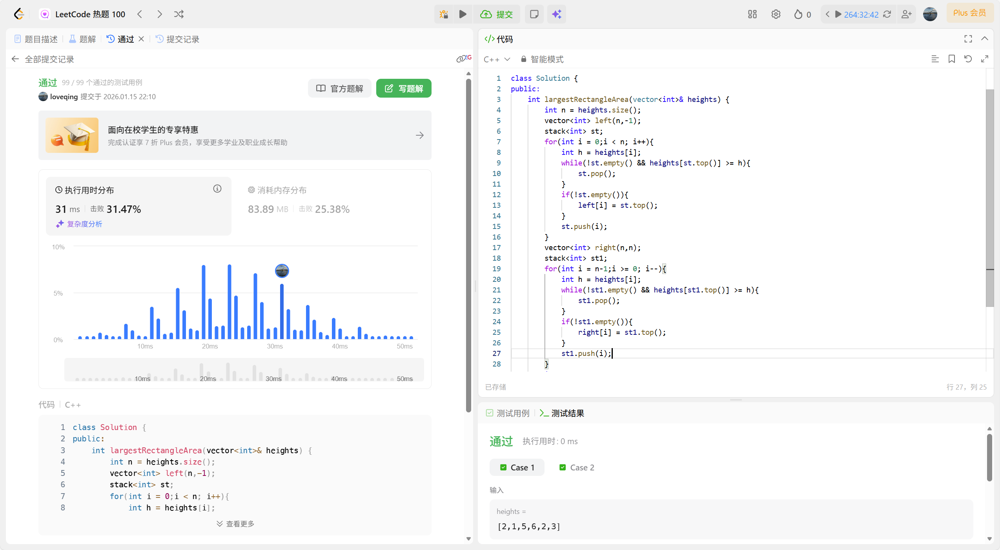

#### [124. 二叉树中的最大路径和](https://leetcode.cn/problems/binary-tree-maximum-path-sum/)

思路：通过递归计算每个节点：以该节点为“路径最高点”的最大路径和（左子树值+节点值+右子树值），并用全局变量res记录所有节点该值的最大值；选取左/右子树中更大的值与节点值相加，若结果为负则返回0为无效分支。递归过程中先遍历左右子树获取贡献值，再计算当前节点的路径和并更新全局最大值，最终返回res即为二叉树的最大路径和。

```c++
/**
 * Definition for a binary tree node.
 * struct TreeNode {
 *     int val;
 *     TreeNode *left;
 *     TreeNode *right;
 *     TreeNode() : val(0), left(nullptr), right(nullptr) {}
 *     TreeNode(int x) : val(x), left(nullptr), right(nullptr) {}
 *     TreeNode(int x, TreeNode *left, TreeNode *right) : val(x), left(left), right(right) {}
 * };
 */
class Solution {
    int res = INT_MIN;

    int depth(TreeNode* root){
        if(root == nullptr) return 0;

        int leftNode = depth(root->left);
        int rigthNode = depth(root->right);
        res = max(res , leftNode + rigthNode + root->val);
        return max(max(leftNode,rigthNode) + root->val,0);
    }

public:
    int maxPathSum(TreeNode* root) {
        depth(root);
        return res;
    }
};
```

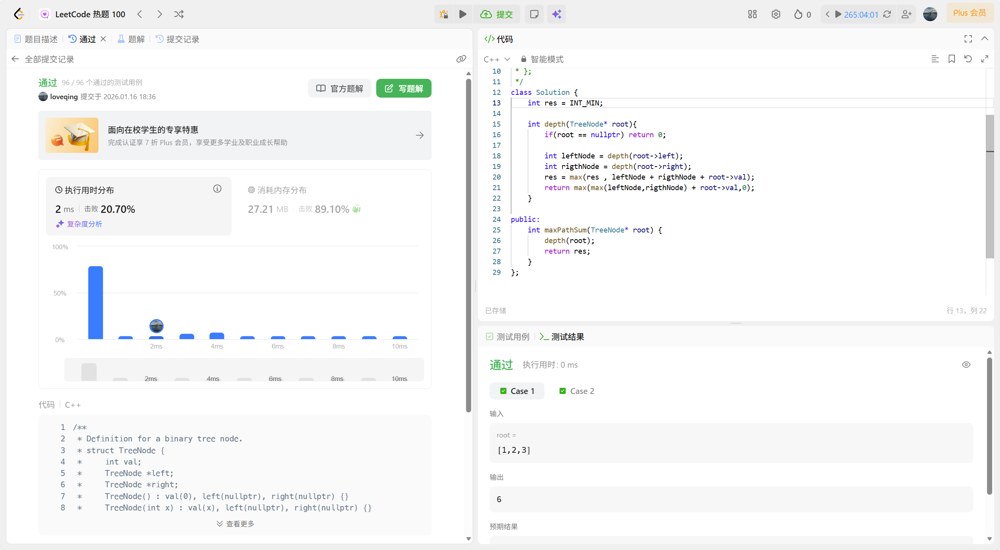

#### [25. K 个一组翻转链表](https://leetcode.cn/problems/reverse-nodes-in-k-group/)

思路：遍历链表统计总节点数，明确能完整划分成多少个 k 节点组（剩余不足 k 个的节点无需反转）；创建虚拟头节点简化链表头的边界处理，并用指针`p`负责衔接每一组反转后的节点；然后以 k 为单位循环处理每一组节点：通过经典头插法（保存下一个节点→当前节点指向临时头后继→临时头指向当前节点）完成该组k个节点的反转，同时记录该组反转前的头节点（反转后变为组尾）；反转后，将组前驱锚点`p`指向反转后的组头，再将组尾连接到下一组的头节点，最后将`p`移动到当前组尾（作为下一组的前驱锚点）；重复上述分组反转与衔接操作直到所有k节点组处理完毕，最终返回全局虚拟头节点的后继节点，即为k个一组反转后的链表头。

```c++
/**
 * Definition for singly-linked list.
 * struct ListNode {
 *     int val;
 *     ListNode *next;
 *     ListNode() : val(0), next(nullptr) {}
 *     ListNode(int x) : val(x), next(nullptr) {}
 *     ListNode(int x, ListNode *next) : val(x), next(next) {}
 * };
 */
class Solution {
public:
    ListNode* reverseKGroup(ListNode* head, int k) {
        int n = 0;
        ListNode* cur = head;
        while(cur){
            n++;
            cur = cur->next;
        }

        ListNode dummy(0, head);
        ListNode* p = &dummy;
        cur = head;

        for(; n >= k; n -= k){
            ListNode tempDummy;
            ListNode* tempHead = &tempDummy;
            ListNode* groupTail = cur;
            for(int i = 0; i < k; i++){
                ListNode* next = cur->next;
                cur->next = tempHead->next;
                tempHead->next = cur;
                cur = next;
            }

            p->next = tempHead->next;
            groupTail->next = cur;
            p = groupTail;
        }
        return dummy.next;
    }
};
```

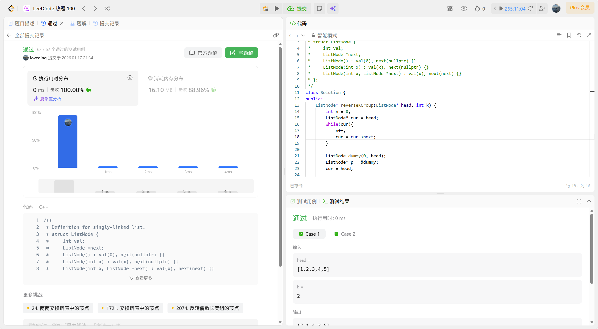

#### [23. 合并 K 个升序链表](https://leetcode.cn/problems/merge-k-sorted-lists/)

思路：使用21.合并两个有序链表题的函数，完成两个有序链表的合并；在此基础上，设计递归分治函数，将待合并的链表区间 [i, j) 不断拆分为左半区间 [i, i+m/2) 和右半区间 [i+m/2, j)（m 为区间长度），递归处理左右子区间直至子区间仅含 0 个或 1 个链表（0 个返回空、1 个直接返回该链表）；最后将左右子区间合并后的结果，通过上述合并两个有序链表的函数再次合并，得到当前区间的合并结果；最终返回的结果即为所有 k 个有序链表合并后的完整有序链表。

```c++
/**
 * Definition for singly-linked list.
 * struct ListNode {
 *     int val;
 *     ListNode *next;
 *     ListNode() : val(0), next(nullptr) {}
 *     ListNode(int x) : val(x), next(nullptr) {}
 *     ListNode(int x, ListNode *next) : val(x), next(next) {}
 * };
 */
class Solution {
     ListNode* mergeTwoLists(ListNode* list1, ListNode* list2) {
        ListNode* p1 = list1;
        ListNode* p2 = list2;
        ListNode* newlist = new ListNode();
        ListNode* p = newlist;
        while(p1&&p2){
            if(p1->val<=p2->val){
                p->next = p1;
                p1=p1->next;
            }else{
                p->next = p2;
                p2=p2->next;
            }
            p=p->next;
        }
        if(p1){
            p->next = p1;
        }else{
            p->next=p2;
        }
        ListNode* result = newlist->next;
        return result;
    }
     // 合并从 lists[i] 到 lists[j-1] 的链表
    ListNode* mergeKLists(vector<ListNode*>& lists, int i, int j) {
    int m = j - i;
    if (m == 0) 
        return nullptr; 
    if (m == 1) {
        return lists[i]; 
    }
    ListNode* left = mergeKLists(lists, i, i + m / 2); // 合并左半部分
    ListNode* right = mergeKLists(lists, i + m / 2, j); // 合并右半部分
    return mergeTwoLists(left, right); // 合并左右两部分结果
    }

public:
    ListNode* mergeKLists(vector<ListNode*>& lists) {
        return mergeKLists(lists, 0, lists.size());
    }
};
```

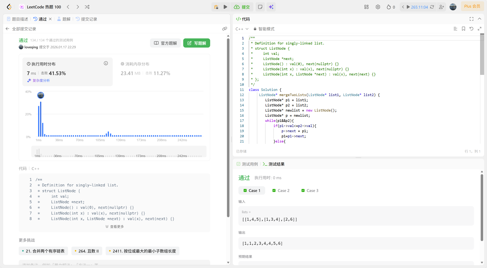

#### [32. 最长有效括号](https://leetcode.cn/problems/longest-valid-parentheses/)

思路：用栈记录有效括号的边界索引，通过索引差值计算有效长度，初始栈并压入-1作为有效括号的起始边界（处理首个字符为右括号的边界情况）；遍历字符串的每个字符并记录其索引，遇到左括号时将其索引压入栈（标记待匹配的左括号位置）；遇到右括号时，若栈内除初始边界外还有元素（说明有可匹配的左括号），则弹出栈顶的左括号索引，用当前右括号索引减去栈顶剩余的边界索引，得到当前有效括号子串的长度，并更新最大长度；若栈内仅剩余初始边界（说明当前右括号无匹配的左括号），则将当前右括号索引替换栈顶的初始边界（作为新的有效括号起始边界）；遍历结束后，记录的最大长度即为最长有效括号子串的长度。

```c++
class Solution {
public:
    int longestValidParentheses(string s) {
        stack<int> stk;
        stk.push(-1);
        int ans = 0;
        for(int i = 0; i < s.size(); i++){
            if(s[i] == '('){
                stk.push(i);
            }else if (stk.size() > 1){
                stk.pop();
                ans = max(ans, i - stk.top());
            }else{
                stk.top() = i;
            }
        }
        return ans;
    }
};
```

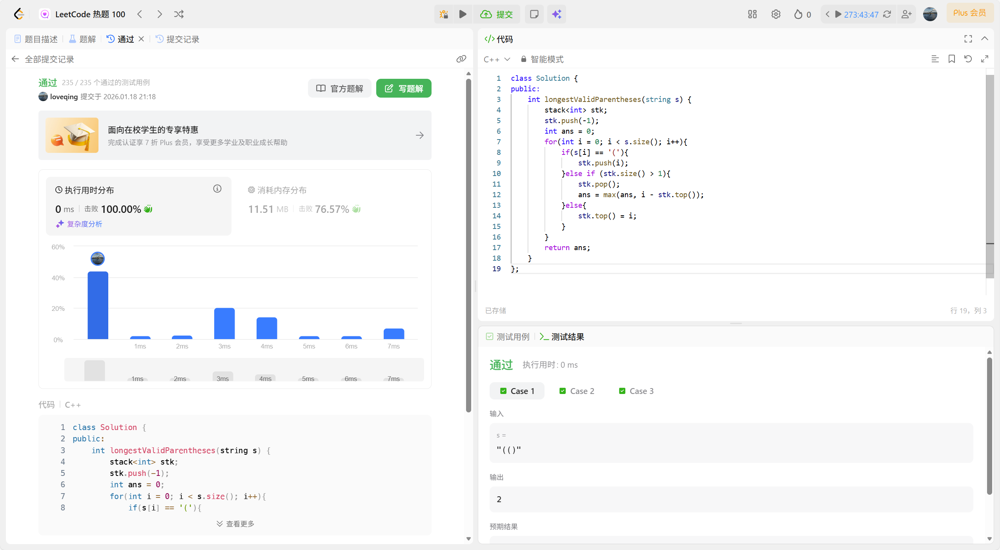

#### [295. 数据流的中位数](https://leetcode.cn/problems/find-median-from-data-stream/)

思路：维护两个优先队列，小顶堆 A 存储较大的一半元素（堆顶为较大部分的最小值），大顶堆 B 存储较小的一半元素（堆顶为较小部分的最大值）；添加元素时，通过动态平衡两个堆的大小（始终保证 A 的大小等于 B 或比 B 大 1）：若两堆大小不等，先将元素加入 A，再把 A 的堆顶移至 B；若大小相等，先将元素加入 B，再把 B 的堆顶移至 A，确保 A 始终存放较大半区且堆顶为中位数候选；查找中位数时，若两堆大小不等（总元素数为奇数），直接返回 A 的堆顶（即中位数）；若大小相等（总元素数为偶数），返回 A 和 B 堆顶的平均值。

```c++
class MedianFinder {
public:
    priority_queue<int, vector<int>, greater<int>> A; // 保存较大的一半
    priority_queue<int, vector<int>, less<int>> B; //保存较小的一半
    MedianFinder() { }
    void addNum(int num) {
        if (A.size() != B.size()) {
            A.push(num);
            B.push(A.top());
            A.pop();
        } else {
            B.push(num);
            A.push(B.top());
            B.pop();
        }
    }
    double findMedian() {
        return A.size() != B.size() ? A.top() : (A.top() + B.top()) / 2.0;
    }
};
/**
 * Your MedianFinder object will be instantiated and called as such:
 * MedianFinder* obj = new MedianFinder();
 * obj->addNum(num);
 * double param_2 = obj->findMedian();
 */
```

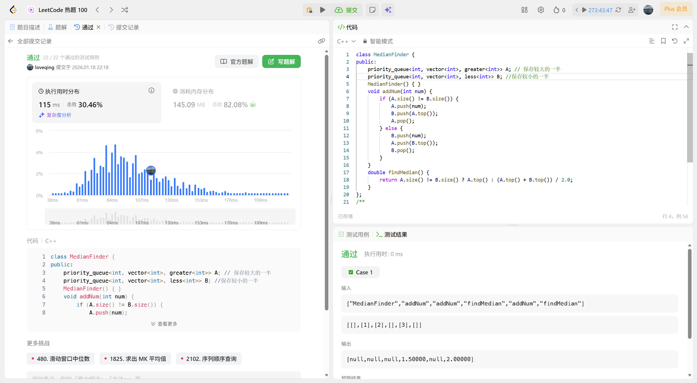
